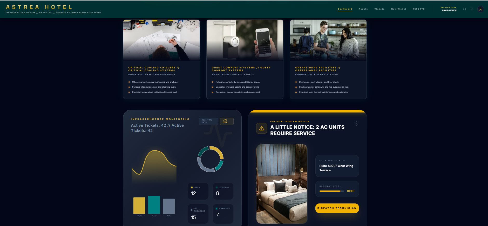
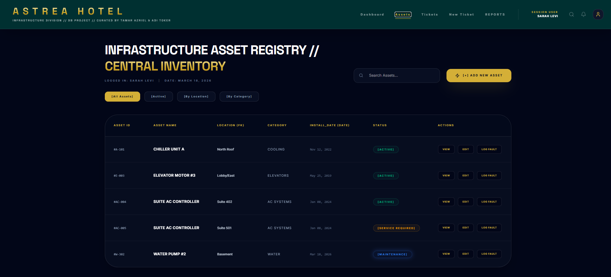
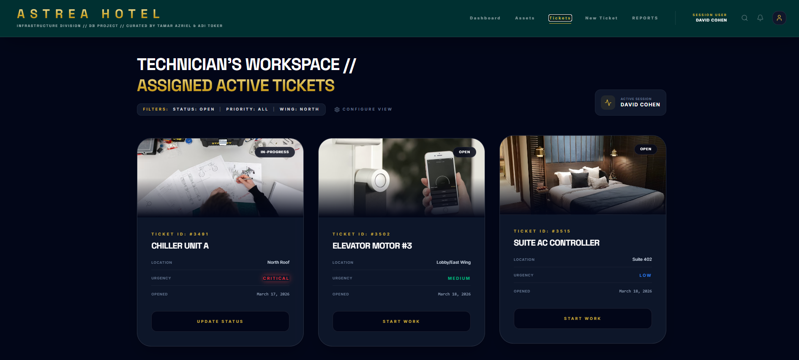
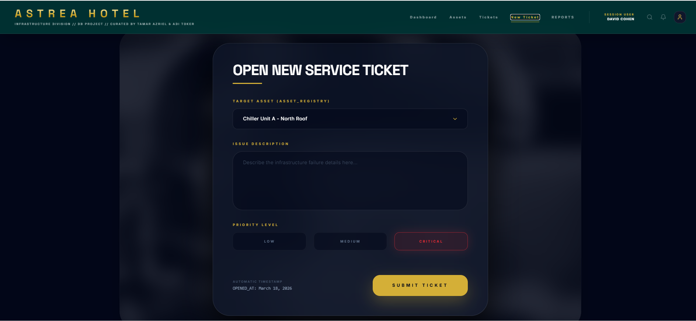
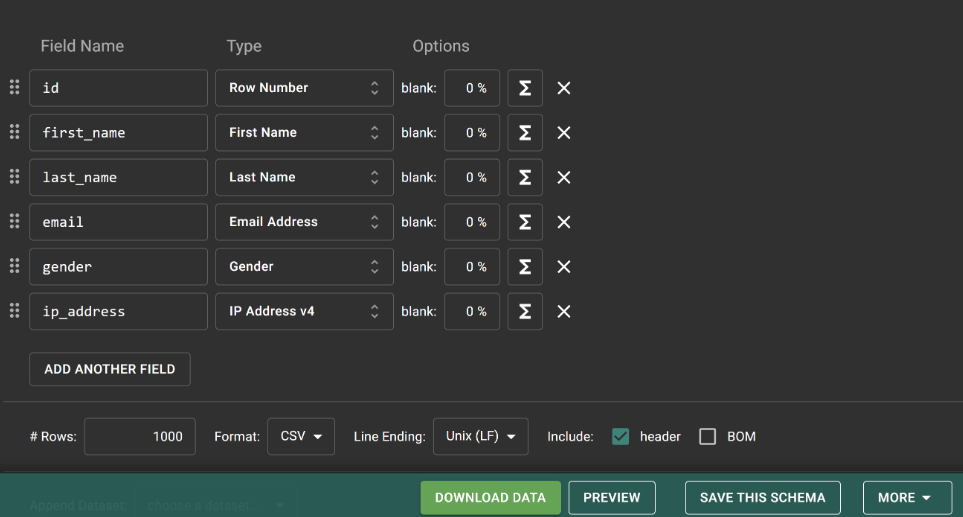
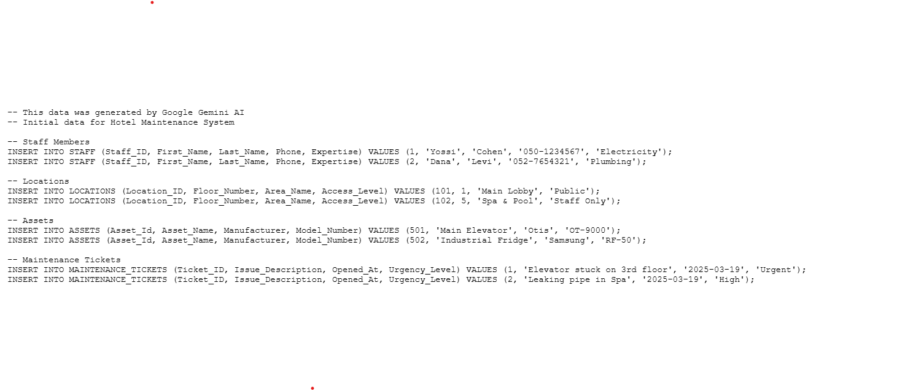

# DBProject_3020_9397
## DPBPROJECT Hotel - Infrastructure & Maintenance Database System

---

# 📘 Project Report

This project is a comprehensive **Infrastructure and Maintenance Management System** for the luxury "ASTREA" Hotel. It was developed as a core component of the Database Systems course to manage high-end technical operations.

# 🧑‍💻 Authors
* **Tamar Azriel**
* **Adi Toker**

---

# 🏢 Project Scope
* **System:** Hotel Management System 
* **Unit:** Infrastructure & Maintenance Division

---

# 📌 Table of Contents
1. [Overview](#-overview)
2. [UI Design (AI Studio)](#-ui-design-ai-studio)
3. [ERD and DSD Diagrams](#-erd-and-dsd-diagrams)
4. [Data Structure Description](#-data-structure-description)
5. [Design Decisions & Normalization](#-design-decisions)
6. [Data Insertion Methods](#-data-insertion-methods)
7. [Backup & Restore](#-backup--restore)

---

# 🧾 Overview
This database system is designed to manage the complex technical heart of a 5-star hotel. It ensures that luxury amenities—from smart room controls to industrial cooling systems—remain operational 24/7.

The system tracks:
* **Asset Registry:** Detailed inventory of all technical equipment and their health status.
* **Service Tickets:** Complete lifecycle of maintenance requests, from reporting to resolution.
* **Staff Management:** Assignment of tasks based on technician expertise (HVAC, Plumbing, Electrical).
* **Vendor Contracts:** Coordination with external service providers for high-end infrastructure maintenance.

# 🗃️ Data Managed in the System
The system maintains a precise and comprehensive registry of all hotel **Infrastructure Assets**. This includes critical systems such as industrial chillers, elevators, smart guest-room control panels, and commercial kitchen equipment. 

For every asset, the database tracks:
* **Location & Placement:** Exact physical coordinates within the hotel.
* **Installation Records:** Dates and warranty tracking.
* **Fault History:** Comprehensive logs of past technical issues.
* **Real-time Status:** Live health monitoring of technical systems.

Additionally, the system manages the **Service Tickets** workflow, assigning maintenance tasks to technical staff, setting priority levels (Low, Medium, Critical), and documenting the entire repair lifecycle.

# ⚙️ Main Functionality
* **Asset Health Management (Asset Registry):** Monitoring and preventive maintenance of critical infrastructures to avoid system failures.
* **Incident Tracking (Ticketing System):** A streamlined process for opening, documenting, and resolving maintenance tickets.
* **Real-time Operational Monitoring:** A management dashboard displaying technician workloads and the status of guest-facing amenities.
* **Guest Experience Optimization:** Ensuring operational continuity (AC, hot water, elevators) to provide an uninterrupted luxury stay for guests.

---

# 🖼️ UI Design (User Interface)
The following four core screens were characterized and designed using **Google AI Studio**.
### 🖥️ Screen 1: Dashboard Overview
This is the **operational hub** of the system, providing a real-time snapshot of the hotel's technical health.

* **Live Asset Monitoring:** High-level status cards for critical systems (Chillers, Guest Comfort, and Kitchen Facilities).
* **Ticket Analytics:** Visual breakdown of **42 Active Tickets**, showing status distribution (Open, Pending, Resolved).
* **Urgent Alerts:** A "Critical System Notice" section flagging high-priority issues, such as **AC units requiring service**.
* **Session Tracking:** Displays the logged-in technician and current system date..
  

#### 📋 Screen 2: Infrastructure Asset Registry
A centralized **inventory management** view displaying all technical assets managed within the database.

* **Data Grid:** Comprehensive table showing **Asset ID, Name, Location (FK), Category, and Install Date**.
* **Status Tracking:** Color-coded status labels for each asset (e.g., Active, Service Required, Maintenance).
* **Advanced Filtering:** Capabilities to sort assets by location, status, or category.
* **Management Actions:** Quick access buttons for viewing details, editing asset data, or logging a fault directly.
  

#### 🛠️ Screen 3: Technician's Workspace
A personalized view for technical staff to manage their **assigned active tickets** and track repair progress.

* **Task Cards:** Detailed visual cards for each ticket, displaying **Ticket ID, Asset Name, Location, Urgency, and Open Date**.
* **Priority Visualization:** High-visibility urgency labels (Critical, Medium, Low) to help technicians prioritize their workflow.
* **Workflow Actions:** Interactive buttons like **"Start Work"** and **"Update Status"** to update the database in real-time.
* **Filtering & Focus:** Quick filters to sort tasks by status (e.g., Open), priority, or hotel wing.
  

### ➕ Screen 4: Open New Service Ticket
A streamlined **data entry form** designed for reporting new infrastructure failures and initiating the repair workflow.

* **Target Asset Selection:** A dynamic dropdown menu linked directly to the `Asset_Registry` (e.g., Chiller Unit A - North Roof).
* **Issue Description:** A detailed input field for documenting technical failure symptoms.
* **Priority Allocation:** Clear selection buttons for **Low, Medium, and Critical** urgency levels, which dictate the response SLA.
* **Automated Metadata:** The system automatically captures the **"Opened_At"** timestamp (e.g., March 18, 2026) to ensure accurate tracking.
  

## 🗂️ ERD and DSD Diagrams

After characterizing the system screens in **Google AI Studio**, we translated the functional requirements into logical and physical data models. The database was designed using **ERD PLUS** and underwent a rigorous normalization process to at least **3rd Normal Form (3NF)** to eliminate redundancy and ensure absolute **Data Integrity**.

### 🧩 ERD (Entity Relationship Diagram)
The ERD illustrates the core entities within the hotel maintenance system, their specific attributes, and the logical relationships between them.

#### 📊 DSD (Data Structure Diagram)
The DSD presents the physical implementation of the database, including Primary Keys (PK), Foreign Keys (FK), and precise data types (Varchar2, Int, Date).

---
# 🗃️ Data Structure Description

Below is a summary of the main entities and their fields as defined in the **ASTREA** Database Schema:

### **Assets**
Represents the technical infrastructure and equipment within the hotel.
* **Asset_Id** (Primary Key)
* **Asset_Name**
* **Manufacturer**
* **Model_Number**
* **Ticket_ID** (Foreign Key)
* **Log_Id** (Foreign Key)

### **Maintenance_Tickets**
Manages the lifecycle of infrastructure repair requests.
* **Ticket_ID** (Primary Key)
* **Issue_Description**
* **Opened_At** (Date)
* **Resolved_At** (Date)
* **Urgency_Level**
* **Ticket_Status**

### **Staff**
Represents the technical personnel assigned to maintenance tasks.
* **Staff_ID** (Primary Key)
* **First_Name**
* **Last_Name**
* **Phone_Number**
* **Expertise**
* **Ticket_ID** (Foreign Key)

### **Locations**
Defines the physical areas and access levels within the hotel.
* **Location_ID** (Primary Key)
* **Floor_Number**
* **Area_Name**
* **Access_Level**
* **Asset_Id** (Foreign Key)

### **Vendors**
External contractors and equipment suppliers.
* **Vendor_Id** (Primary Key)
* **Company_Name**
* **Contract_Number**
* **Contact_Person**
* **Asset_Id** (Foreign Key)

### **Inspection_Log**
Detailed technical records of inspections and maintenance outcomes.
* **Log_Id** (Primary Key)
* **Inspection_Result**
* **Technician_Result**
* **Technician_Notes**
* **Tools_Used**

📄 **SQL table creation scripts are included in the Stage 1 folder.**

# ⚙️ Design Decisions & Normalization

During the architectural phase of the **ASTREA Hotel** database, several critical design decisions were made to ensure a high-performance, scalable, and stable system:

### 1. Staff Management & Expertise (Staff Entity)
* **Decision:** We isolated technical staff details into a dedicated `Staff` entity, featuring a specialized `Expertise` attribute.
* **Reasoning:** This allows the system to intelligently assign service tickets based on a technician's specific skill set (e.g., Electrical, Plumbing, HVAC). This normalization step prevents data redundancy (storing names/phones repeatedly) and optimizes human resource management.

### 2. Strategic Use of Temporal Data (DATE Fields)
* **Decision:** We implemented two vital timestamp attributes in the `Maintenance_Tickets` table: `Opened_At` and `Resolved_At`.
* **Reasoning:** This is essential for professional hotel management. It enables the measurement of **Resolution Time (SLA tracking)**, analyzes staff workload, and generates performance reports showing average response times across different departments.

### 3. Comprehensive Technical Documentation (Inspection_Log)
* **Decision:** A separate `Inspection_Log` entity was created and linked to each Service Ticket.
* **Reasoning:** This creates a clear distinction between the initial problem description and the actual technical outcome. By storing data like `Tools_Used` and `Inspection_Result`, the system maintains a detailed historical record of how expensive assets are being serviced.

### 4. Vendor & Warranty Integration (Vendors)
* **Decision:** We established a direct relationship between Infrastructure `Assets` and their respective `Vendors`.
* **Reasoning:** In a luxury environment, complex systems (elevators, chillers) are often maintained by third-party firms. Storing vendor details and the `Contract_Number` alongside the asset ensures immediate access to support during critical failures and guarantees warranty compliance.

### 5. Granular Location Mapping (Locations)
* **Decision:** The `Locations` table was designed with specific fields: `Floor_Number`, `Area_Name`, and `Access_Level`.
* **Reasoning:** This eliminates data redundancy and maintains naming consistency across the hotel. The `Access_Level` attribute provides crucial safety and security information, informing technicians if special clearance is required for restricted areas like machine rooms or rooftops.
## 📥 Data Insertion Methods

### ✅ Method A: Python Script

---

### ✅ Method B: Mockaroo Generator.

---

### ✅ Method C: AI Studio
.

### ✅ Backup & Restore Strategy

**Backup**

**Restore**

