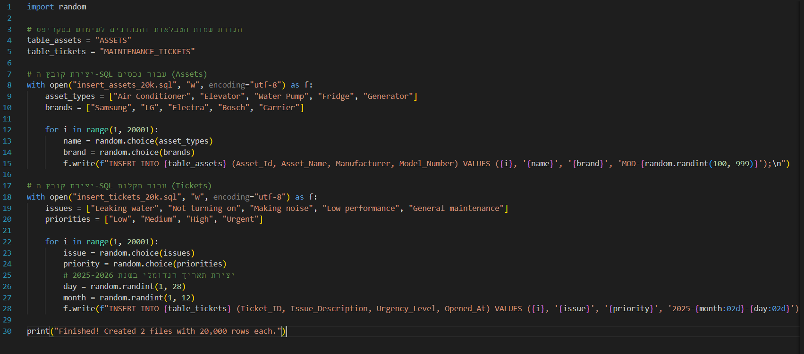

# DBProject_3020_9397
## DPBPROJECT Hotel - Infrastructure & Maintenance Database System

---

# 📘 Project Report

This project is a comprehensive **Infrastructure and Maintenance Management System** for the luxury "ASTREA" Hotel. It was developed as a core component of the Database Systems course to manage high-end technical operations.

# 🧑‍💻 Authors
* **Tamar Azriel**
* **Adi Toker**

---

# 🏢 Project Scope
* **System:** Hotel Management System 
* **Unit:** Infrastructure & Maintenance Division

---

# 📌 Table of Contents
1. [Overview](#-overview)
2. [UI Design (AI Studio)](#-ui-design-ai-studio)
3. [ERD and DSD Diagrams](#-erd-and-dsd-diagrams)
4. [Data Structure Description](#-data-structure-description)
5. [Design Decisions & Normalization](#-design-decisions)
6. [Data Insertion Methods](#-data-insertion-methods)
7. [Backup & Restore](#-backup--restore)

---

# 🧾 Overview
This database system is designed to manage the complex technical heart of a 5-star hotel. It ensures that luxury amenities—from smart room controls to industrial cooling systems—remain operational 24/7.

The system tracks:
* **Asset Registry:** Detailed inventory of all technical equipment and their health status.
* **Service Tickets:** Complete lifecycle of maintenance requests, from reporting to resolution.
* **Staff Management:** Assignment of tasks based on technician expertise (HVAC, Plumbing, Electrical).
* **Vendor Contracts:** Coordination with external service providers for high-end infrastructure maintenance.

# 🗃️ Data Managed in the System
The system maintains a precise and comprehensive registry of all hotel **Infrastructure Assets**. This includes critical systems such as industrial chillers, elevators, smart guest-room control panels, and commercial kitchen equipment. 

For every asset, the database tracks:
* **Location & Placement:** Exact physical coordinates within the hotel.
* **Installation Records:** Dates and warranty tracking.
* **Fault History:** Comprehensive logs of past technical issues.
* **Real-time Status:** Live health monitoring of technical systems.

Additionally, the system manages the **Service Tickets** workflow, assigning maintenance tasks to technical staff, setting priority levels (Low, Medium, Critical), and documenting the entire repair lifecycle.

# ⚙️ Main Functionality
* **Asset Health Management (Asset Registry):** Monitoring and preventive maintenance of critical infrastructures to avoid system failures.
* **Incident Tracking (Ticketing System):** A streamlined process for opening, documenting, and resolving maintenance tickets.
* **Real-time Operational Monitoring:** A management dashboard displaying technician workloads and the status of guest-facing amenities.
* **Guest Experience Optimization:** Ensuring operational continuity (AC, hot water, elevators) to provide an uninterrupted luxury stay for guests.

---

# 🖼️ UI Design (User Interface)
The following four core screens were characterized and designed using **Google AI Studio**.
### 🖥️ Screen 1: Dashboard Overview

The **Operational Intelligence Hub** provides a high-fidelity, real-time snapshot of the hotel's technical health, aggregating data from 20,000+ assets into actionable KPIs, live activity streams, and urgency-based alerts.

* **Live Asset Monitoring:** High-level status cards for critical systems including HVAC, Guest Comfort, and Kitchen Facilities.
* **Ticket Analytics:** Visual breakdown of **42 Active Tickets**, showcasing status distribution and technician utilization.
* **Urgent Alerts:** A "Critical System Notice" section flagging high-priority issues to ensure immediate maintenance response.
* **Session Tracking:** Displays the logged-in user profile and current system status at a glance.
  

### 🛠️ Screen 2: The Control Center

The **Control Center** is the management engine of the system, designed to monitor and coordinate the lifecycle of 20,482+ active maintenance tickets and assets with high granularity.

* **Advanced Ticket Table:** A centralized view of every maintenance event, including Ticket IDs, asset descriptions, and specific locations (e.g., "Floor 4 • Wing B").
* **Dynamic Status & Priority Badges:** Visual indicators for urgency (Urgent, High, Medium, Low) and workflow stages (In Progress, Pending, Closed) to ensure zero bottlenecks.
* **Technician Assignment:** Direct visualization of the assigned staff member for each ticket, pulling live data from the `Staff` table.
* **Smart Search & Filtering:** A robust search interface allowing for instant filtering across thousands of records by Ticket ID, Asset, or Technician.
* **Seamless Pagination:** Optimized for large-scale data handling, ensuring smooth navigation through the 20,000+ record database.
  

### 📝 Screen 3: New Maintenance Request

The **Intelligent Dispatch System** is a streamlined data-entry interface used to register new incidents and ensure they are routed to the correct technician.

* **Asset Identification:** An intelligent search bar that queries 20,482+ assets in real-time to link the ticket to the correct equipment ID.
* **Urgency Selector:** A high-visibility priority toggle (Low, Medium, High, Urgent) to define the service-level agreement (SLA) for the request.
* **Issue Description:** A dedicated field for detailed technical requirements, which is stored as `Issue_Description` in the backend.
* **Smart Validation:** Prevents ghost tickets by ensuring every request is mapped to a valid `Asset_Id` and `Location_Id` before submission.
  

### 🔍 Screen 4: Asset Dossier (Detailed View)

The **Asset Dossier** is a deep-dive diagnostic interface providing a 360-degree view of a single piece of equipment, such as the **Carrier Chiller Unit 4**.

* **Technical Specifications:** Displays granular data from the `Assets` table, including model numbers, capacity, and installation dates.
* **Vendor & Support:** Integrated contact information pulled directly from the `Vendors` table for immediate emergency communication.
* **Maintenance Timeline:** A chronological audit trail of the asset's history, showcasing data from the `Inspection_Log` and past `Maintenance_Tickets`.
* **Real-time Telemetry (Mockup):** Visualization of current operating parameters (Temp, Pressure, Load), illustrating the system's potential for IoT integration.
* **Operational Actions:** Quick-action buttons for exporting technical reports or scheduling preventive maintenance directly from the dossier.
  

### 🔗 [View Live Interactive Prototype](https://aistudio.google.com/apps/55148c2e-690d-46d4-ab92-a373640f0e38?showAssistant=true&showPreview=true)

## 🗂️ ERD and DSD Diagrams

After characterizing the system screens in **Google AI Studio**, we translated the functional requirements into logical and physical data models. The database was designed using **ERD PLUS** and underwent a rigorous normalization process to at least **3rd Normal Form (3NF)** to eliminate redundancy and ensure absolute **Data Integrity**.

### 🧩 ERD (Entity Relationship Diagram)
The ERD illustrates the core entities within the hotel maintenance system, their specific attributes, and the logical relationships between them.

#### 📊 DSD (Data Structure Diagram)
The DSD presents the physical implementation of the database, including Primary Keys (PK), Foreign Keys (FK), and precise data types (Varchar2, Int, Date).

---
# 🗃️ Data Structure Description

The database is designed with a highly normalized relational schema to ensure data integrity and query performance.

### **1. Assets**
The core entity representing all technical equipment.
* **`Asset_Id`** (Primary Key)
* **`Asset_Name`**, **`Asset_Category`** (HVAC, Plumbing, Electronics, etc.)
* **`Manufacturer`**, **`Model_Number`**
* **`Installation_Date`**, **`Status`** (Active/Down)
* **`Location_Id`** (Foreign Key → `Locations`)
* **`Vendor_Id`** (Foreign Key → `Vendors`)

### **2. Maintenance_Tickets**
Tracking the lifecycle of repair and service requests.
* **`Ticket_ID`** (Primary Key)
* **`Issue_Description`**, **`Urgency_Level`** (Low to Urgent), **`Ticket_Status`**
* **`Opened_At`**, **`Resolved_At`**
* **`Asset_Id`** (Foreign Key → `Assets`)
* **`Staff_Id`** (Foreign Key → `Staff`) - *Assigned Technician*

### **3. Staff**
Internal technical personnel and expertise management.
* **`Staff_ID`** (Primary Key)
* **`First_Name`**, **`Last_Name`**, **`Phone_Number`**
* **`Expertise`** (e.g., Electrician, IT, Mechanical)

### **4. Locations**
Mapping the hotel’s physical rooms and infrastructure zones.
* **`Location_ID`** (Primary Key)
* **`Floor_Number`**, **`Area_Name`**
* **`Access_Level`** (Public, Staff Only, Maintenance)

### **5. Vendors**
External suppliers and service contractors management.
* **`Vendor_Id`** (Primary Key)
* **`Company_Name`**, **`Contact_Person`**, **`Support_Email`**
* **`Contract_Number`**

### **6. Inspection_Log**
Detailed technical audit trail for routine checks.
* **`Log_Id`** (Primary Key)
* **`Inspection_Date`**, **`Inspection_Result`**, **`Tools_Used`**
* **`Asset_Id`** (Foreign Key → `Assets`)
* **`Staff_Id`** (Foreign Key → `Staff`)

---
## 🧠 Design Decisions & Normalization Strategy

* **Skill-Based Allocation (`Staff` & `Expertise`):** By isolating technician skills, the system enables intelligent dispatching and eliminates data redundancy.
* **Temporal Analytics (SLA Tracking):** Implementation of dual timestamps (`Opened_At` & `Resolved_At`) allows for measuring **Mean Time to Repair (MTTR)**.
* **Separation of Concerns (`Inspection_Log`):** Decouples incident reports from technical outcomes, ensuring a clean audit trail for safety compliance.
* **Third-Party Dependency Mapping (`Vendors`):** Directly linking assets to vendors ensures immediate escalation paths during critical failures.
* **Hierarchical Location Intelligence:** Granular mapping of `Access_Level` ensures technicians are aware of security protocols before arriving at restricted zones.

## 📥 Data Insertion Methods

### ✅ Method A: Python Script

---

### ✅ Method B: Mockaroo Generator.

---

### ✅ Method C: AI Studio
.

### ✅ Backup & Restore Strategy

**Backup**

**Restore**

