## DPBPROJECT Hotel - Infrastructure & Maintenance Database System

---

# 📘 Project Report

This project is a comprehensive **Infrastructure and Maintenance Management System** for Hotel. It was developed as a core component of the Database Systems course to manage high-end technical operations.

# 🧑‍💻 Authors
* **Tamar Azriel**
* **Adi Toker**

---

# 🏢 Project Scope
* **System:** Hotel Management System 
* **Unit:** Infrastructure & Maintenance Division

---

# 📌 Table of Contents
1. [Overview](#-overview)
2. [UI Design (AI Studio)](#-ui-design-ai-studio)
3. [ERD and DSD Diagrams](#-erd-and-dsd-diagrams)
4. [Data Structure Description](#-data-structure-description)
5. [Design Decisions & Normalization](#-design-decisions)
6. [Data Insertion Methods](#-data-insertion-methods)
7. [Backup & Restore](#-backup--restore)

---

# 🧾 Overview
This database system is designed to manage the complex technical heart of a 5-star hotel. It ensures that luxury amenities—from smart room controls to industrial cooling systems—remain operational 24/7.

The system tracks:
* **Asset Registry:** Detailed inventory of all technical equipment and their health status.
* **Service Tickets:** Complete lifecycle of maintenance requests, from reporting to resolution.
* **Staff Management:** Assignment of tasks based on technician expertise (HVAC, Plumbing, Electrical).
* **Vendor Contracts:** Coordination with external service providers for high-end infrastructure maintenance.

# 🗃️ Data Managed in the System
The system maintains a precise and comprehensive registry of all hotel **Infrastructure Assets**. This includes critical systems such as industrial chillers, elevators, smart guest-room control panels, and commercial kitchen equipment. 

For every asset, the database tracks:
* **Location & Placement:** Exact physical coordinates within the hotel.
* **Installation Records:** Dates and warranty tracking.
* **Fault History:** Comprehensive logs of past technical issues.
* **Real-time Status:** Live health monitoring of technical systems.

Additionally, the system manages the **Service Tickets** workflow, assigning maintenance tasks to technical staff, setting priority levels (Low, Medium, Critical), and documenting the entire repair lifecycle.

# ⚙️ Main Functionality
* **Asset Health Management (Asset Registry):** Monitoring and preventive maintenance of critical infrastructures to avoid system failures.
* **Incident Tracking (Ticketing System):** A streamlined process for opening, documenting, and resolving maintenance tickets.
* **Real-time Operational Monitoring:** A management dashboard displaying technician workloads and the status of guest-facing amenities.
* **Guest Experience Optimization:** Ensuring operational continuity (AC, hot water, elevators) to provide an uninterrupted luxury stay for guests.

---

# 🖼️ UI Design (User Interface)
The following four core screens were characterized and designed using **Google AI Studio**.
### 🖥️ Screen 1: Dashboard Overview

The **Operational Intelligence Hub** provides a high-fidelity, real-time snapshot of the hotel's technical health, aggregating data from 20,000+ assets into actionable KPIs, live activity streams, and urgency-based alerts.

* **Live Asset Monitoring:** High-level status cards for critical systems including HVAC, Guest Comfort, and Kitchen Facilities.
* **Ticket Analytics:** Visual breakdown of **42 Active Tickets**, showcasing status distribution and technician utilization.
* **Urgent Alerts:** A "Critical System Notice" section flagging high-priority issues to ensure immediate maintenance response.
* **Session Tracking:** Displays the logged-in user profile and current system status at a glance.
  
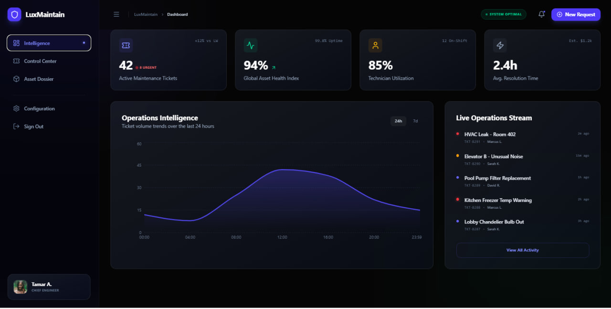

### 🛠️ Screen 2: The Control Center

The **Control Center** is the management engine of the system, designed to monitor and coordinate the lifecycle of 20,482+ active maintenance tickets and assets with high granularity.

* **Advanced Ticket Table:** A centralized view of every maintenance event, including Ticket IDs, asset descriptions, and specific locations (e.g., "Floor 4 • Wing B").
* **Dynamic Status & Priority Badges:** Visual indicators for urgency (Urgent, High, Medium, Low) and workflow stages (In Progress, Pending, Closed) to ensure zero bottlenecks.
* **Technician Assignment:** Direct visualization of the assigned staff member for each ticket, pulling live data from the `Staff` table.
* **Smart Search & Filtering:** A robust search interface allowing for instant filtering across thousands of records by Ticket ID, Asset, or Technician.
* **Seamless Pagination:** Optimized for large-scale data handling, ensuring smooth navigation through the 20,000+ record database.
  
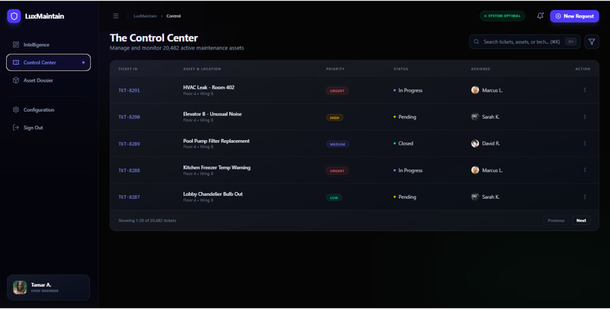

### 📝 Screen 3: New Maintenance Request

The **Intelligent Dispatch System** is a streamlined data-entry interface used to register new incidents and ensure they are routed to the correct technician.

* **Asset Identification:** An intelligent search bar that queries 20,482+ assets in real-time to link the ticket to the correct equipment ID.
* **Urgency Selector:** A high-visibility priority toggle (Low, Medium, High, Urgent) to define the service-level agreement (SLA) for the request.
* **Issue Description:** A dedicated field for detailed technical requirements, which is stored as `Issue_Description` in the backend.
* **Smart Validation:** Prevents ghost tickets by ensuring every request is mapped to a valid `Asset_Id` and `Location_Id` before submission.
  
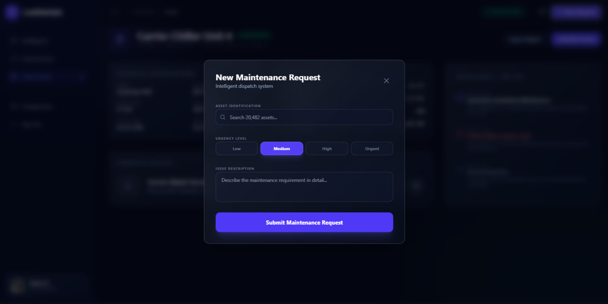

### 🔍 Screen 4: Asset Dossier (Detailed View)

The **Asset Dossier** is a deep-dive diagnostic interface providing a 360-degree view of a single piece of equipment, such as the **Carrier Chiller Unit 4**.

* **Technical Specifications:** Displays granular data from the `Assets` table, including model numbers, capacity, and installation dates.
* **Vendor & Support:** Integrated contact information pulled directly from the `Vendors` table for immediate emergency communication.
* **Maintenance Timeline:** A chronological audit trail of the asset's history, showcasing data from the `Inspection_Log` and past `Maintenance_Tickets`.
* **Real-time Telemetry (Mockup):** Visualization of current operating parameters (Temp, Pressure, Load), illustrating the system's potential for IoT integration.
* **Operational Actions:** Quick-action buttons for exporting technical reports or scheduling preventive maintenance directly from the dossier.
  
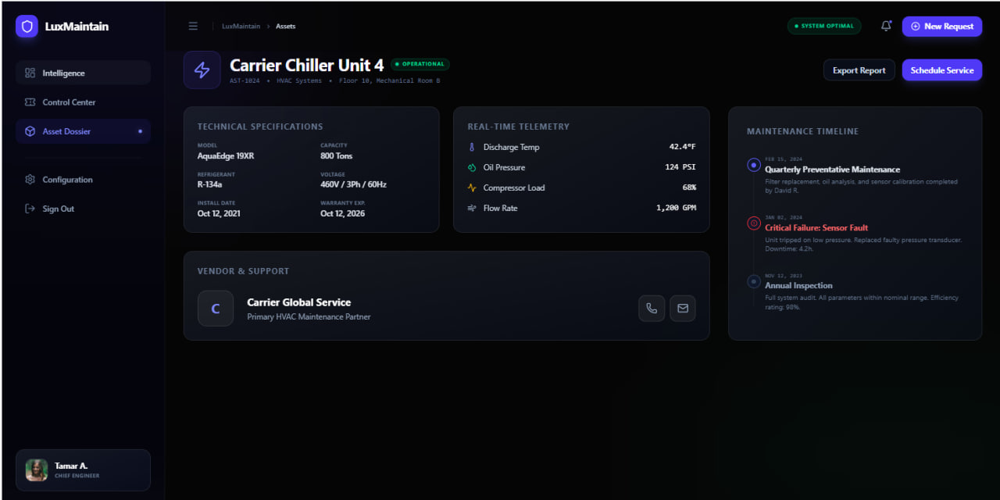

### 🔗 [View Live Interactive Prototype](https://aistudio.google.com/apps/55148c2e-690d-46d4-ab92-a373640f0e38?showAssistant=true&showPreview=true)

## 🗂️ ERD and DSD Diagrams

After characterizing the system screens in **Google AI Studio**, we translated the functional requirements into logical and physical data models. The database was designed using **ERD PLUS** and underwent a rigorous normalization process to at least **3rd Normal Form (3NF)** to eliminate redundancy and ensure absolute **Data Integrity**.

### 🧩 ERD (Entity Relationship Diagram)
The ERD illustrates the core entities within the hotel maintenance system, their specific attributes, and the logical relationships between them.

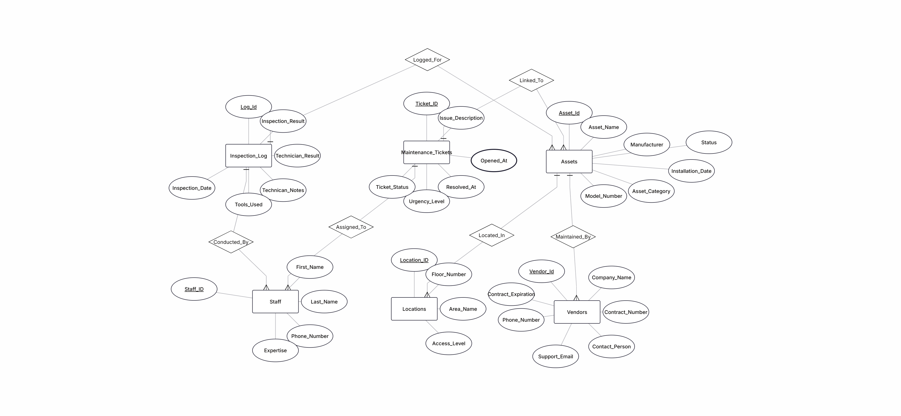

#### 📊 DSD (Data Structure Diagram)
The DSD presents the physical implementation of the database, including Primary Keys (PK), Foreign Keys (FK), and precise data types (Varchar2, Int, Date).

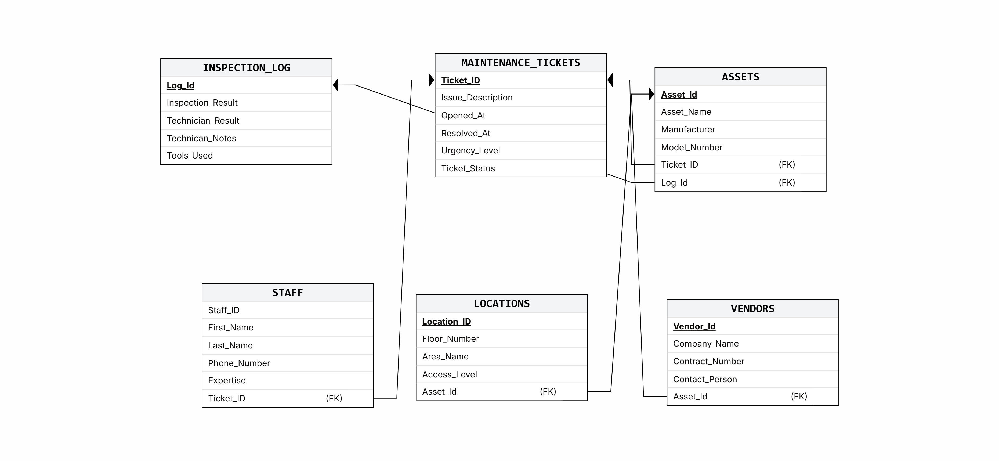

---
# 🗃️ Data Structure Description

The database is designed with a highly normalized relational schema to ensure data integrity and query performance.

### **1. Assets**
The core entity representing all technical equipment.
* **`Asset_Id`** (Primary Key)
* **`Asset_Name`**, **`Asset_Category`** (HVAC, Plumbing, Electronics, etc.)
* **`Manufacturer`**, **`Model_Number`**
* **`Installation_Date`**, **`Status`** (Active/Down)
* **`Location_Id`** (Foreign Key → `Locations`)
* **`Vendor_Id`** (Foreign Key → `Vendors`)

### **2. Maintenance_Tickets**
Tracking the lifecycle of repair and service requests.
* **`Ticket_ID`** (Primary Key)
* **`Issue_Description`**, **`Urgency_Level`** (Low to Urgent), **`Ticket_Status`**
* **`Opened_At`**, **`Resolved_At`**
* **`Asset_Id`** (Foreign Key → `Assets`)
* **`Staff_Id`** (Foreign Key → `Staff`) - *Assigned Technician*

### **3. Staff**
Internal technical personnel and expertise management.
* **`Staff_ID`** (Primary Key)
* **`First_Name`**, **`Last_Name`**, **`Phone_Number`**
* **`Expertise`** (e.g., Electrician, IT, Mechanical)

### **4. Locations**
Mapping the hotel’s physical rooms and infrastructure zones.
* **`Location_ID`** (Primary Key)
* **`Floor_Number`**, **`Area_Name`**
* **`Access_Level`** (Public, Staff Only, Maintenance)

### **5. Vendors**
External suppliers and service contractors management.
* **`Vendor_Id`** (Primary Key)
* **`Company_Name`**, **`Contact_Person`**, **`Support_Email`**
* **`Contract_Number`**

### **6. Inspection_Log**
Detailed technical audit trail for routine checks.
* **`Log_Id`** (Primary Key)
* **`Inspection_Date`**, **`Inspection_Result`**, **`Tools_Used`**
* **`Asset_Id`** (Foreign Key → `Assets`)
* **`Staff_Id`** (Foreign Key → `Staff`)

---
## 🧠 Design Decisions & Normalization Strategy

* **Skill-Based Allocation (`Staff` & `Expertise`):** By isolating technician skills, the system enables intelligent dispatching and eliminates data redundancy.
* **Temporal Analytics (SLA Tracking):** Implementation of dual timestamps (`Opened_At` & `Resolved_At`) allows for measuring **Mean Time to Repair (MTTR)**.
* **Separation of Concerns (`Inspection_Log`):** Decouples incident reports from technical outcomes, ensuring a clean audit trail for safety compliance.
* **Third-Party Dependency Mapping (`Vendors`):** Directly linking assets to vendors ensures immediate escalation paths during critical failures.
* **Hierarchical Location Intelligence:** Granular mapping of `Access_Level` ensures technicians are aware of security protocols before arriving at restricted zones.


## 📥 Data Insertion Methods


### ✅ Method A: Python Script

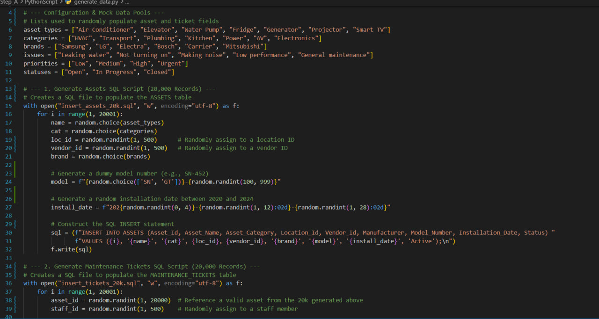

---

### ✅ Method B: Mockaroo Generator.

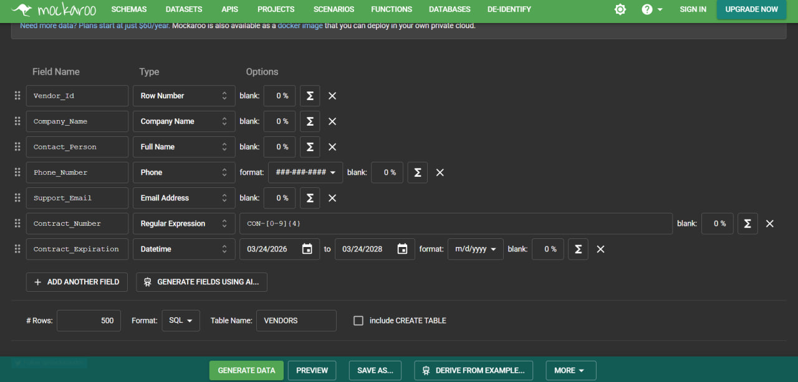
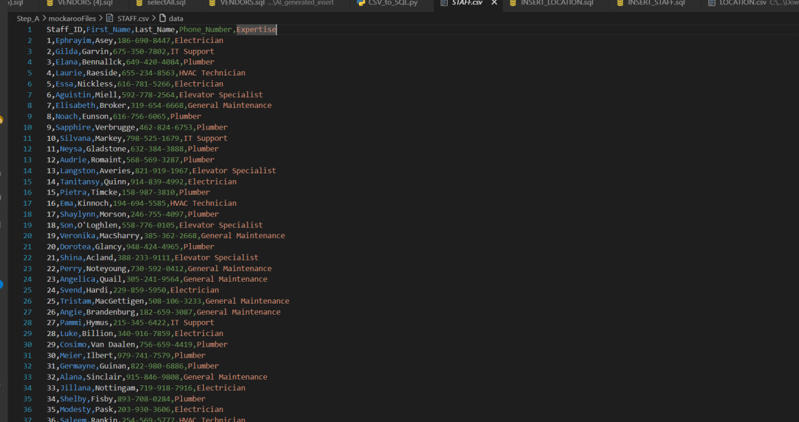


---

### ✅ Method C: AI Studio
.

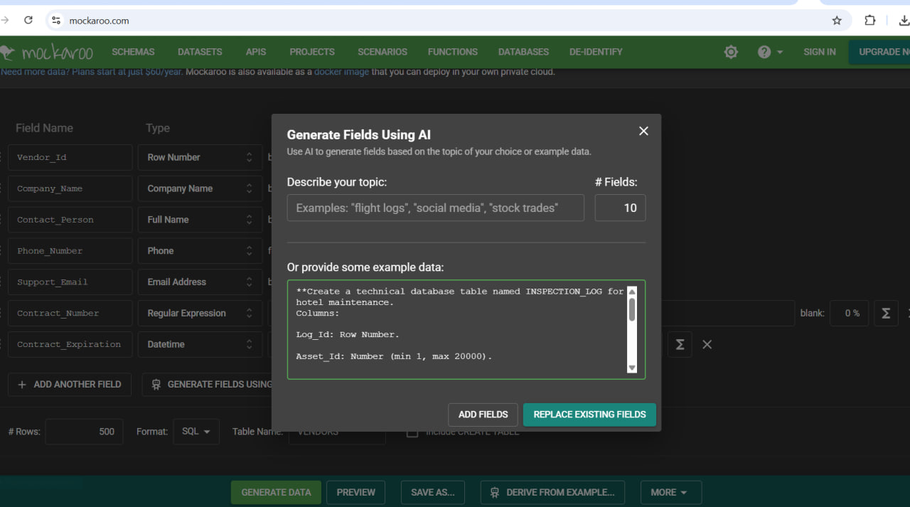

### ✅ Backup & Restore Strategy

**Backup**


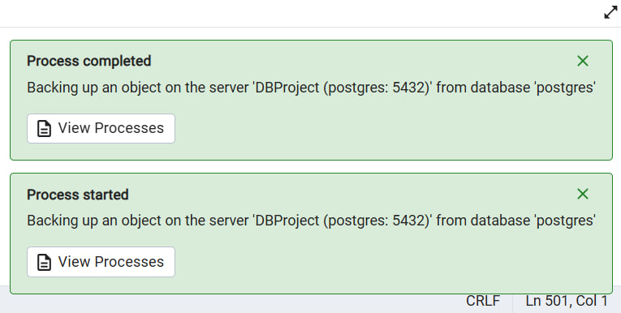


**Restore**


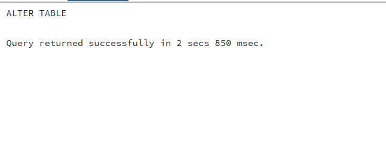


# 🚀 Step B: Advanced Data Querying & Schema Refinement

**Overview:** In this phase, we developed efficient, UI-aligned queries to extract actionable operational insights and refined our database schema using `ALTER TABLE` commands to perfectly support the system's functional requirements.

## 🔍 חקירת נתונים ותשאול מתקדם (Double Queries)
בחלק זה ביצענו תשאול של בסיס הנתונים באמצעות שאילתות מורכבות. עבור דרישות מסוימות, כתבנו את השאילתות בשתי צורות שונות (כגון שימוש ב-JOIN לעומת Subquery) במטרה לבחון ולהבין את הבדלי היעילות ואופן הפעולה של מנוע בסיס הנתונים (Query Optimizer).

---

### 📌 שאילתה 1: טכנאים מצטיינים בסגירת תקלות דחופות
**תיאור השאילתה:** השאילתה מציגה את פרטי הטכנאים (שם, משפחה וטלפון) שסגרו מעל 5 תקלות דחופות במהלך שנת 2025, יחד עם כמות התקלות הכוללת שסגרו. המטרה היא לאתר טכנאים בעלי עומס עבודה גבוה או תפוקה גבוהה לטובת תגמול.

**קוד השאילתה:**

-- צורה א' (JOIN)
```sql

SELECT S.First_Name, S.Last_Name, S.Phone_Number, COUNT(T.Ticket_ID) AS Total_Closed
FROM STAFF S
JOIN MAINTENANCE_TICKETS T ON S.Staff_ID = T.Staff_ID
WHERE T.Ticket_Status = 'Closed' AND EXTRACT(YEAR FROM T.Opened_At) = 2025
GROUP BY S.Staff_ID, S.First_Name, S.Last_Name, S.Phone_Number
HAVING COUNT(T.Ticket_ID) > 5;
-- צורה ב' (Subquery)
SELECT First_Name, Last_Name, Phone_Number
FROM STAFF
WHERE Staff_ID IN (
    SELECT Staff_ID 
    FROM MAINTENANCE_TICKETS
    WHERE Ticket_Status = 'Closed' AND EXTRACT(YEAR FROM Opened_At) = 2025
    GROUP BY Staff_ID 
    HAVING COUNT(Ticket_ID) > 5
);
```
**צילומי מסך:**

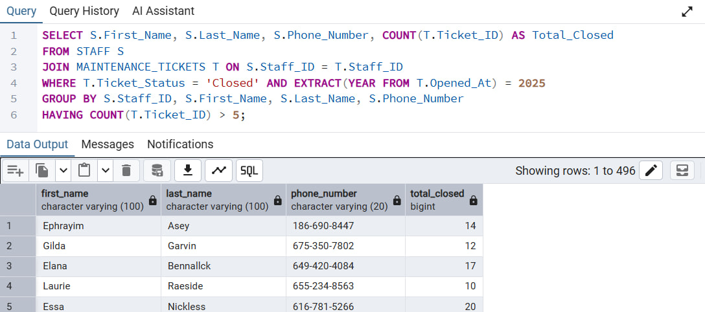

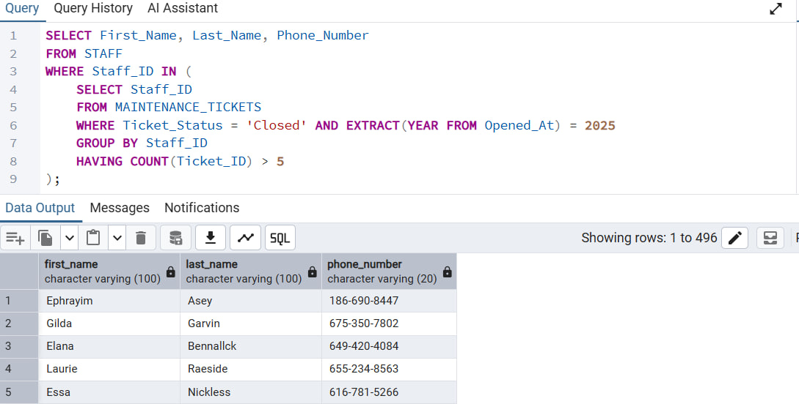

**הסבר ויעילות:** **צורה א' (JOIN) עדיפה ויעילה יותר.** מנוע בסיס הנתונים המודרני מותאם לבצע אופטימיזציה לחיבור (JOIN) של טבלאות בבת אחת (למשל בעזרת Hash Join או Merge Join). לעומת זאת, צורה ב' (Subquery עם IN) עלולה לאלץ את המנוע לבצע סריקות נפרדות – קודם לחשב את התת-שאילתה במלואה ורק אז לסנן את טבלת ה-STAFF. ה-JOIN מונע סריקות כפולות של נתונים וחוסך במשאבי זיכרון.


### 📌 שאילתה 2: נכסים הממוקמים באזורים ציבוריים 
**תיאור השאילתה:** השאילתה שולפת רשימה ייחודית של שמות נכסים ויצרנים עבור ציוד הממוקם באזורים בעלי רמת גישה ציבורית (Public). מידע זה רלוונטי להערכת סיכונים של השחתת ציוד על ידי אורחים.

**קוד השאילתה:**

-- צורה א' (JOIN)
```sql

SELECT DISTINCT A.Asset_Name, A.Manufacturer
FROM ASSETS A
JOIN LOCATIONS L ON A.Location_ID = L.Location_ID
WHERE L.Access_Level = 'Public';

-- צורה ב' (EXISTS)
SELECT Asset_Name, Manufacturer
FROM ASSETS A
WHERE EXISTS (
    SELECT 1 
    FROM LOCATIONS L 
    WHERE L.Location_ID = A.Location_ID AND L.Access_Level = 'Public'
);
```
**צילומי מסך:**

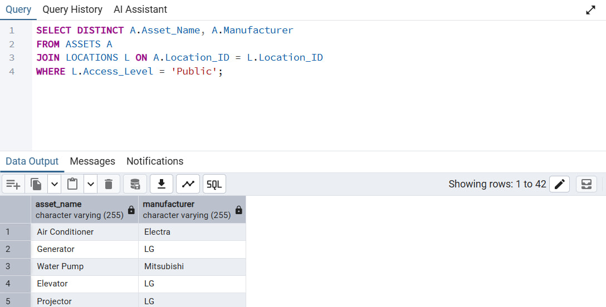

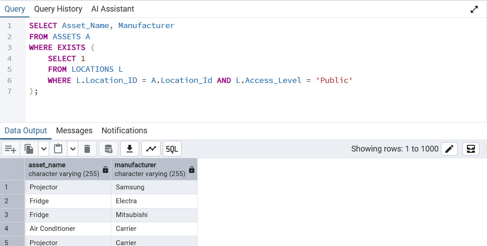

**הסבר ויעילות:** במקרה זה, צורה ב' (EXISTS) נוטה להיות מהירה ויעילה יותר, במיוחד כאשר טבלת המיקומים גדולה. הפקודה EXISTS פועלת במנגנון של "Short-Circuit" (עצירה מהירה) – ברגע שהמנוע מוצא התאמה אחת בטבלת LOCATIONS עבור הנכס הספציפי, הוא מפסיק לחפש ומחזיר TRUE. לעומת זאת, שימוש ב-JOIN (צורה א') עלול לייצר מכפלה של רשומות שאותן צריך לצמצם לאחר מכן באמצעות הפקודה היקרה DISTINCT, מה שגורם לעבודת מיון וסינון מיותרת.


### 📌 שאילתה 3: ספקים שציוד שלהם חווה תקלה קריטית כעת 
**תיאור השאילתה:** השאילתה מאתרת את שמות החברות ואנשי הקשר של ספקים (Vendors) שסיפקו נכסים אשר מדווחים כרגע עם תקלה פתוחה בדרגת דחיפות 'קריטית'. שאילתה זו חיונית להתקשרות חירום עם ספקים לתיקון ציוד.
**קוד השאילתה:**

-- צורה א' (JOIN כפול)
```sql

SELECT DISTINCT V.Company_Name, V.Contact_Person
FROM VENDORS V
JOIN ASSETS A ON V.Vendor_ID = A.Vendor_ID
JOIN MAINTENANCE_TICKETS T ON A.Asset_ID = T.Asset_ID
WHERE T.Ticket_Status = 'Open' AND T.Urgency_Level = 'Urgent';

-- צורה ב' (Nested IN - קינון עמוק)
SELECT Company_Name, Contact_Person 
FROM VENDORS 
WHERE Vendor_ID IN (
    SELECT Vendor_ID FROM ASSETS WHERE Asset_ID IN (
        SELECT Asset_ID FROM MAINTENANCE_TICKETS 
        WHERE Ticket_Status = 'Open' AND Urgency_Level = 'Urgent'
    )
);
```
**צילומי מסך:**

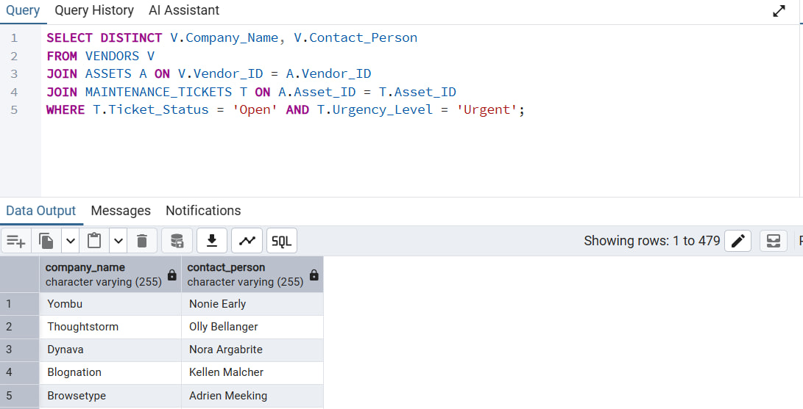

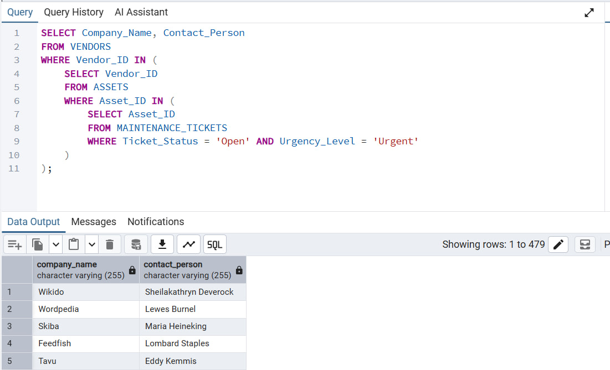

**הסבר ויעילות:** צורה א' (JOIN) היא היעילה ביותר כאן. שימוש בתת-שאילתות מקוננות (Nested IN) כפי שמוצג בצורה ב' יוצר צוואר בקבוק עיבודי. בסיס הנתונים נאלץ לרוב לבצע את הפעולות בצורה סדרתית מהפנים החוצה. לעומת זאת, כאשר משתמשים ב-JOIN, ה-Optimizer רואה את כל התמונה ויכול לבחור את סדר קריאת הטבלאות המהיר ביותר (למשל, להתחיל מטבלת התקלות שהיא הקטנה ביותר לאחר סינון הסטטוס, ורק אז להצליב למפתחות הזרים של הספקים).


### 📌 שאילתה 4: תקלות שנסגרו ביום הפתיחה (SLA מיידי) 
**תיאור השאילתה:** השאילתה מחזירה את תיאור התקלה ואת זמני הפתיחה והסגירה עבור תקלות שתוקנו ונסגרו באותו היום שבו נפתחו. נתון זה מעיד על יעילות שיא של צוות התחזוקה.
**קוד השאילתה:**
```sql
-- צורה א' (שימוש בפונקציה על העמודה)
SELECT Issue_Description, Opened_At, Resolved_At
FROM MAINTENANCE_TICKETS
WHERE Resolved_At - Opened_At = 0;

-- צורה ב' (השוואה ישירה עם המרה)
SELECT Issue_Description, Opened_At, Resolved_At
FROM MAINTENANCE_TICKETS
WHERE Opened_At = Resolved_At;
```

**צילומי מסך:**

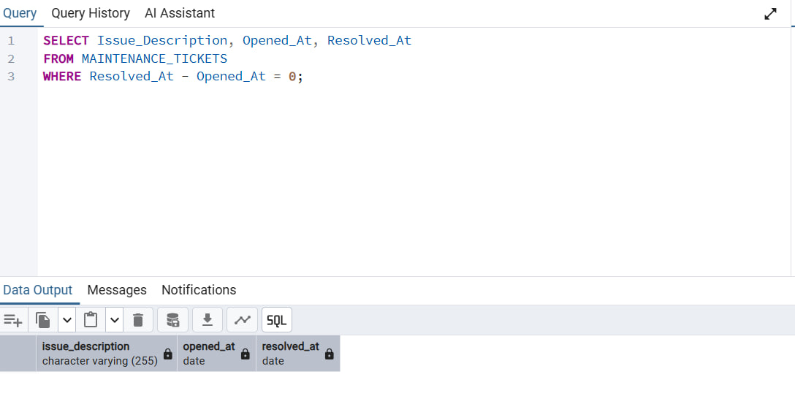

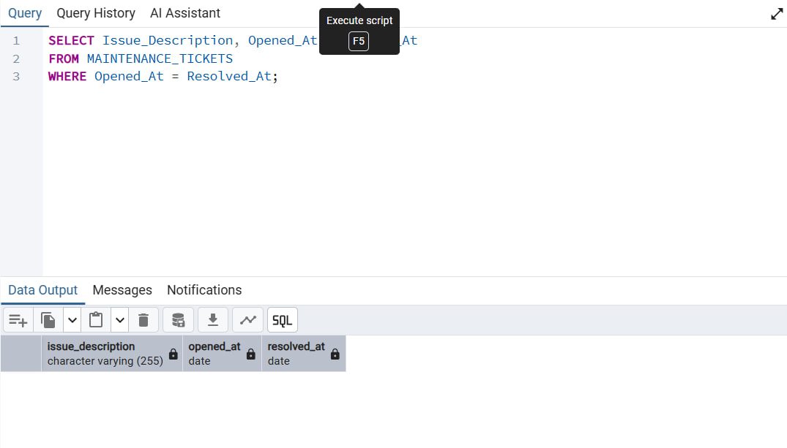

**הסבר ויעילות:** באופן כללי, צורה ב' עדיפה. הפעלת פונקציה אריתמטית או פונקציית תאריכים ישירות על עמודה (כמו בצורה א') יוצרת מצב שנקרא Non-Sargable. המשמעות היא שבסיס הנתונים אינו יכול להשתמש באינדקסים קיימים על עמודות התאריכים, והוא נאלץ לבצע פונקציה על כל שורה ושורה בטבלה (Full Table Scan). בצורה ב', המרה פשוטה ל-DATE (ביטול שעות) מאפשרת השוואה ישירה שיכולה להסתמך טוב יותר על ארכיטקטורת אינדקסים, מה שמשפר את זמן התגובה.


## 📊 תשאול מורכב נוסף (Single Queries)
בחלק זה יצרנו שאילתות מורכבות נוספות המשלבות מספר טבלאות, פונקציות קיבוץ (Aggregation) וסינונים מתקדמים, כדי להפיק דוחות תפעוליים שוטפים עבור הנהלת המלון.

---

### 📌 שאילתה 5: סיכום תקלות חודשי
**תיאור השאילתה:** שאילתה זו מפיקה דוח סטטיסטי המציג את כמות התקלות שנפתחו בכל חודש ושנה. הנתונים מקובצים לפי חודש ושנה וממוינים מהתאריך החדש ביותר לישן ביותר. המידע חיוני לזיהוי מגמות או חודשים עם עומס חריג (למשל תקלות מיזוג בקיץ).

**קוד השאילתה:**
```sql
SELECT First_Name, Last_Name, Expertise
FROM STAFF S
WHERE NOT EXISTS (
    SELECT 1 FROM MAINTENANCE_TICKETS T 
    WHERE T.Staff_ID = S.Staff_ID 
    AND T.Opened_At > CURRENT_DATE - INTERVAL '1 month'
);
```

**צילומי מסך:**

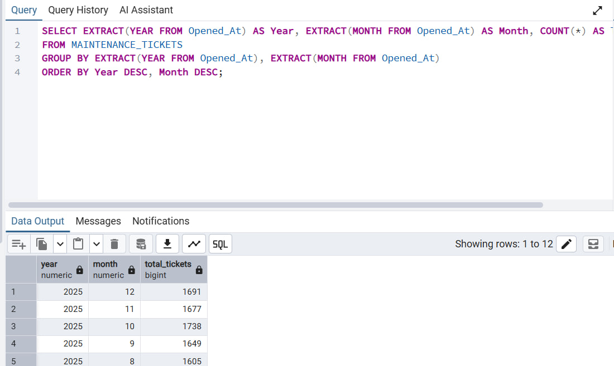


### 📌 שאילתה 6: איתור צוות לא פעיל (שימוש ב-NOT EXISTS)
**תיאור השאילתה:** השאילתה מאתרת טכנאים מצוות התחזוקה (שם, משפחה ומומחיות) שלא פתחו או טיפלו באף תקלה בחודש האחרון. זהו כלי ניהולי חשוב שנועד לוודא חלוקת עומסים נכונה ואיתור עובדים שאינם מנצלים את זמנם כראוי או שנמצאים בחופשה ארוכה.

**קוד השאילתה:**
```sql
SELECT First_Name, Last_Name, Expertise
FROM STAFF S
WHERE NOT EXISTS (
    SELECT 1 
    FROM MAINTENANCE_TICKETS T 
    WHERE T.Staff_ID = S.Staff_ID 
    AND T.Opened_At > CURRENT_DATE - INTERVAL '1 month'
);
```

**צילומי מסך:**

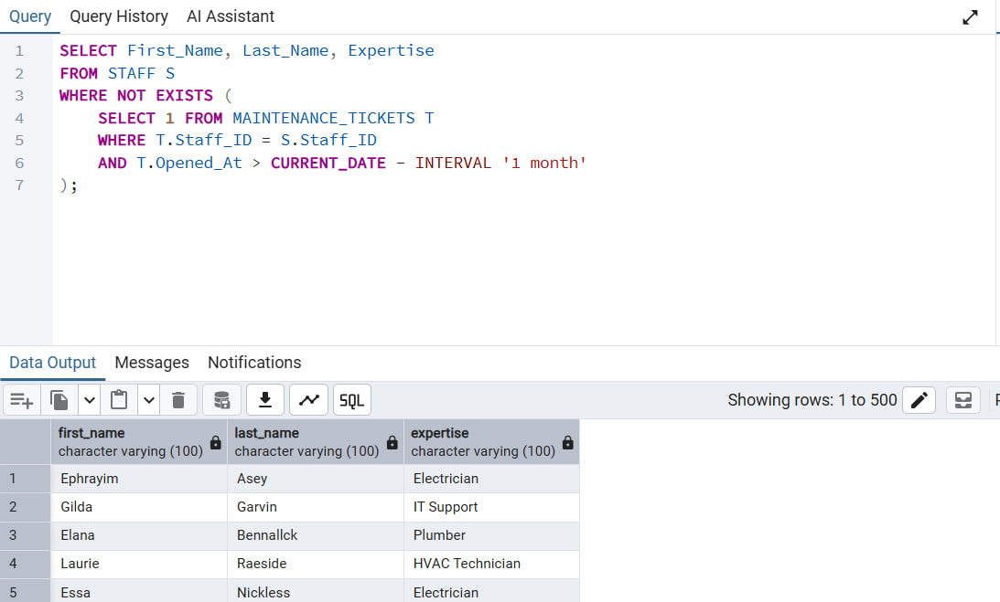


### 📌 שאילתה 7: נכסים בעייתיים - מרובי כישלונות בבדיקה
**תיאור השאילתה:** שאילתה זו משלבת 3 טבלאות (Assets, Staff, Inspection_Log) כדי לאתר ציוד ספציפי שנכשל ביותר מ-3 בדיקות תחזוקה שוטפות. הדו"ח מציג את שם הנכס, היצרן, ומספר הכישלונות, וממוין מהנכס הבעייתי ביותר מטה, במטרה לשקול החלפת ציוד פגום במקום להמשיך לתקן אותו.

**קוד השאילתה:**
```sql
SELECT A.Asset_Name, A.Manufacturer, S.First_Name, S.Last_Name, COUNT(I.Log_Id) AS Failed_Inspections
FROM ASSETS A
JOIN INSPECTION_LOG I ON A.Asset_ID = I.Asset_ID
JOIN STAFF S ON I.Staff_ID = S.Staff_ID
WHERE I.Inspection_Result = 'Fail'
GROUP BY A.Asset_ID, A.Asset_Name, A.Manufacturer, S.First_Name, S.Last_Name
HAVING COUNT(I.Log_Id) > 0
ORDER BY Failed_Inspections DESC;
```

**צילומי מסך:**

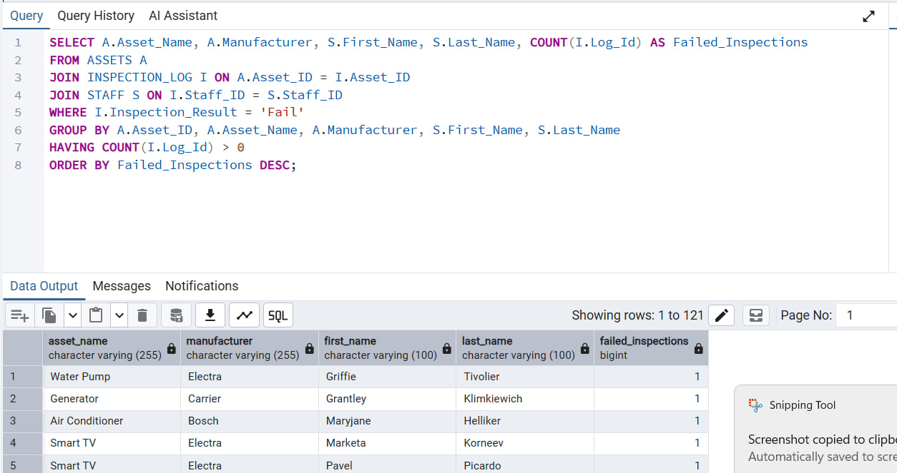


### 📌 שאילתה 8: דוח תקלות דחופות עם מיקום מדויק
**תיאור השאילתה:** השאילתה מפיקה דוח חירום של כל התקלות שנמצאות כעת בסטטוס 'פתוח' (Open) ורמת הדחיפות שלהן היא 'גבוהה' (High) או 'קריטית' (Urgent). הדו"ח מצליב נתונים מול טבלת המיקומים כדי לספק לטכנאי את הקומה והאזור המדויקים, וממוין לפי קומה כדי לייעל את מסלול ההליכה של הטכנאי.

**קוד השאילתה:**
```sql
SELECT T.Issue_Description, T.Urgency_Level, L.Area_Name, L.Floor_Number
FROM MAINTENANCE_TICKETS T
JOIN ASSETS A ON T.Asset_ID = A.Asset_ID
JOIN LOCATIONS L ON A.Location_ID = L.Location_ID
WHERE T.Ticket_Status = 'Open' AND T.Urgency_Level IN ('High', 'Urgent')
ORDER BY L.Floor_Number ASC;
```


**צילומי מסך:**

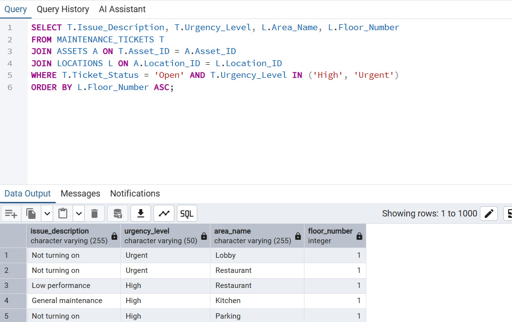


## 🛠️ עדכון נתונים (UPDATE Queries)
בפרק זה ביצענו פעולות תחזוקה אקטיביות על הנתונים במערכת כדי לשמור על עדכניות המידע, לנהל סיכונים ולשפר את הטיפול בתקלות המלון.

---

### 🔄 עדכון 1: העלאת דחיפות לתקלות ישנות שלא טופלו
**תיאור השאילתה:** השאילתה עוברת על טבלת התקלות (Maintenance_Tickets) ומאתרת תקלות שעדיין פתוחות (`Ticket_Status = 'Open'`) ועברו יותר מ-14 ימים מרגע פתיחתן. השאילתה מעדכנת את רמת הדחיפות שלהן ל-'Urgent' (קריטי) כדי להקפיץ אותן לראש סדר העדיפויות של צוות התחזוקה ולמנוע פגיעה בחוויית האורחים.

**קוד השאילתה:**
```sql
UPDATE MAINTENANCE_TICKETS
SET Urgency_Level = 'Urgent'
WHERE Ticket_Status = 'Open' AND Opened_At < CURRENT_DATE - INTERVAL '14 days';
```
**תיעוד הביצוע:**
* **לפני העדכון:**
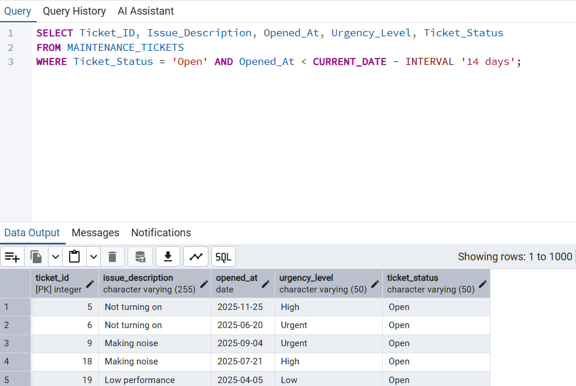

**הרצת הפקודה:**
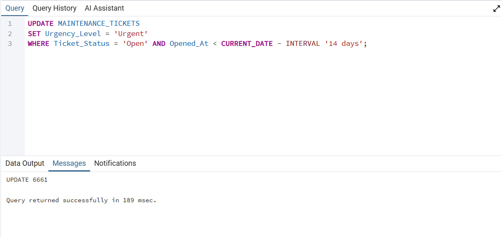

* **אחרי העדכון:**


### 🔄 עדכון 2: סימון נכסים שדורשים תיקון בעקבות כישלון בבדיקה
**תיאור השאילתה:** השאילתה בודקת את יומן הבדיקות (Inspection_Log). אם נכס מסוים נכשל בבדיקה האחרונה שלו (Fail), השאילתה ניגשת לטבלת הנכסים (Assets) ומשרשרת לשם הנכס את ההערה " - NEEDS REPAIR". פעולה זו מספקת חיווי ויזואלי מיידי במסכי המערכת לגבי מצב הציוד.
**קוד השאילתה:**
```sql
UPDATE ASSETS
SET Asset_Name = Asset_Name || ' - NEEDS REPAIR'
WHERE Asset_ID IN (
    SELECT Asset_ID 
    FROM INSPECTION_LOG 
    WHERE Inspection_Result = 'Fail'
);
```
**תיעוד הביצוע:**
* **לפני העדכון:**
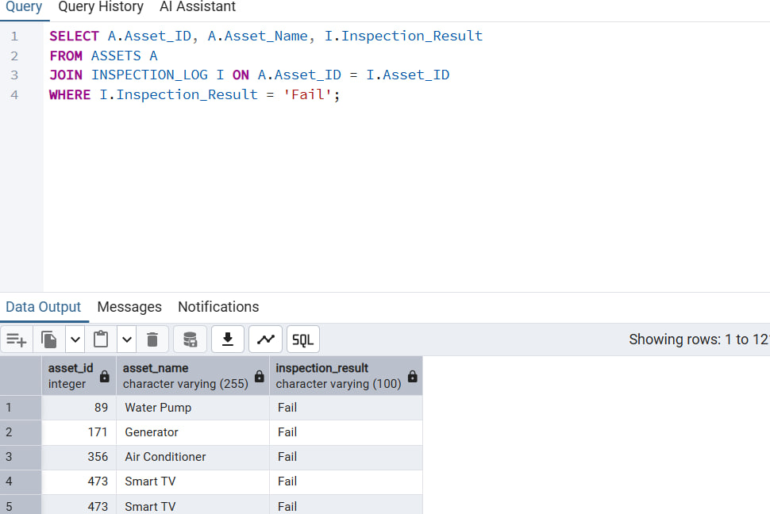

**הרצת הפקודה:**
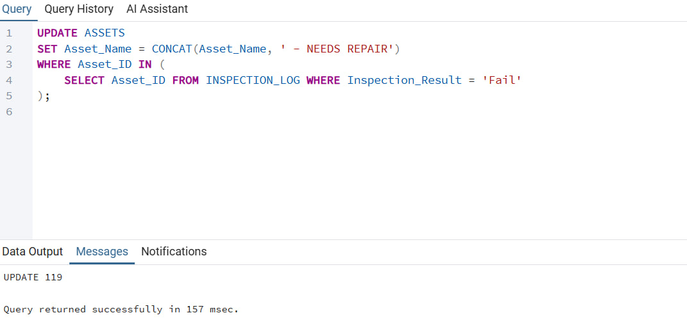

* **אחרי העדכון:**
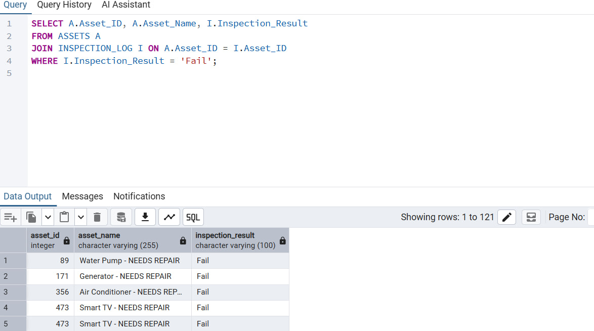

  
### 🔄 עדכון 3: עדכון תאריך סגירה אוטומטי לתקלות
**תיאור השאילתה:** במקרים שבהם טכנאי העביר סטטוס של תקלה ל-'Closed' (סגור) אך שכח להזין את תאריך הסגירה (Resolved_At IS NULL), השאילתה מזהה את חוסר העקביות הזה ומעדכנת אוטומטית את תאריך הסגירה לתאריך של היום (CURRENT_DATE). זה מבטיח שלמות נתונים לטובת חישובי זמני טיפול (SLA)..
**קוד השאילתה:**
```sql
UPDATE MAINTENANCE_TICKETS
SET Resolved_At = CURRENT_DATE
WHERE Ticket_Status = 'Closed' AND Resolved_At IS NULL;
```
**לפני העדכון:**
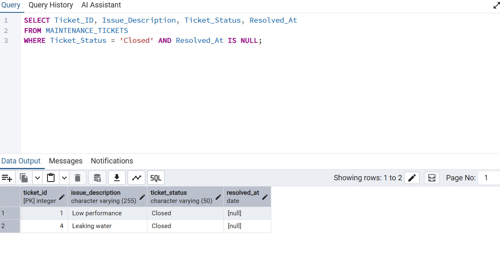

**הרצת הפקודה:**
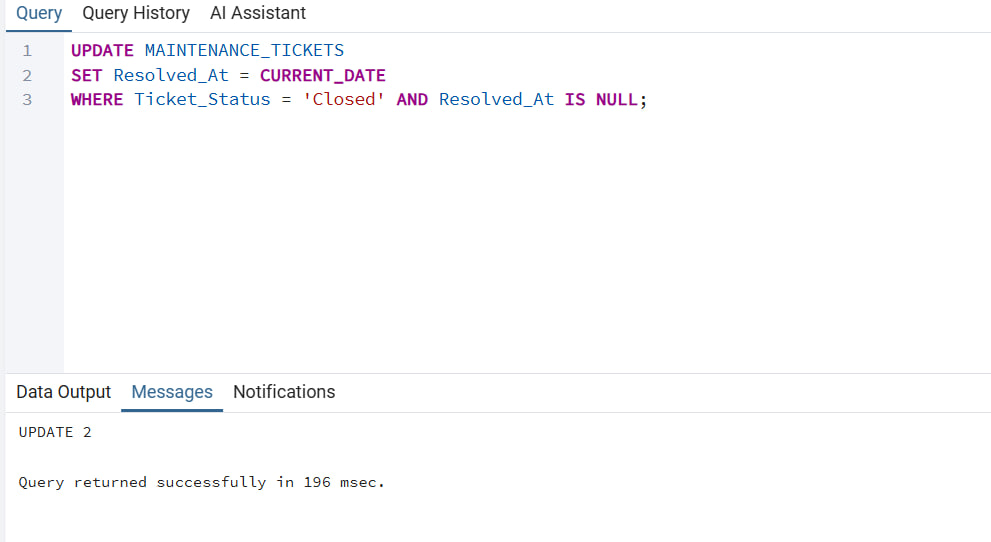

* **אחרי העדכון:**
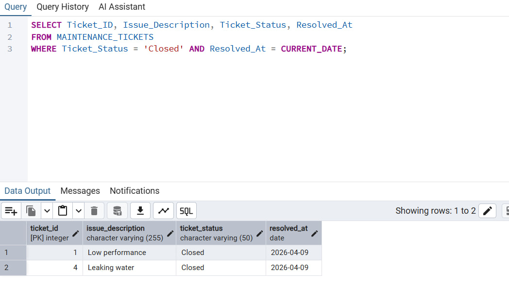


🗑️ מחיקת נתונים (DELETE Queries)
בחלק זה ביצענו פעולות של ניקוי נתונים ישנים או יתומים במטרה לחסוך בשטח אחסון, לייעל את חיפושי המערכת ולשמור על מסד נתונים רזה ומדויק.

❌ מחיקה 1: ארכיון יומני בדיקה ישנים ותקינים
תיאור השאילתה: השאילתה מוחקת רשומות מיומן הבדיקות (Inspection_Log) שעונות על שני תנאים: הבדיקה עברה בהצלחה (Pass) והיא התבצעה לפני שנת 2024. אין צורך לשמור היסטוריית תקינות ישנה במערכת הפעילה, ופעולה זו מקטינה את גודל הטבלה ומשפרת ביצועים.
**קוד השאילתה:**
```sql
DELETE FROM INSPECTION_LOG
WHERE Inspection_Result = 'Pass' AND Inspection_Date < '2024-01-01';
```
**תיעוד הביצוע**
**לפני המחיקה:**
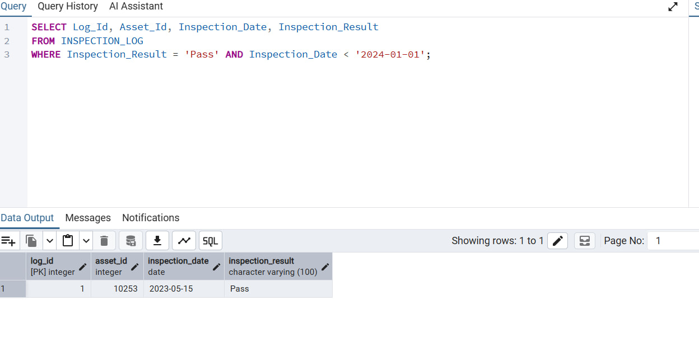

**הרצת הפקודה:**
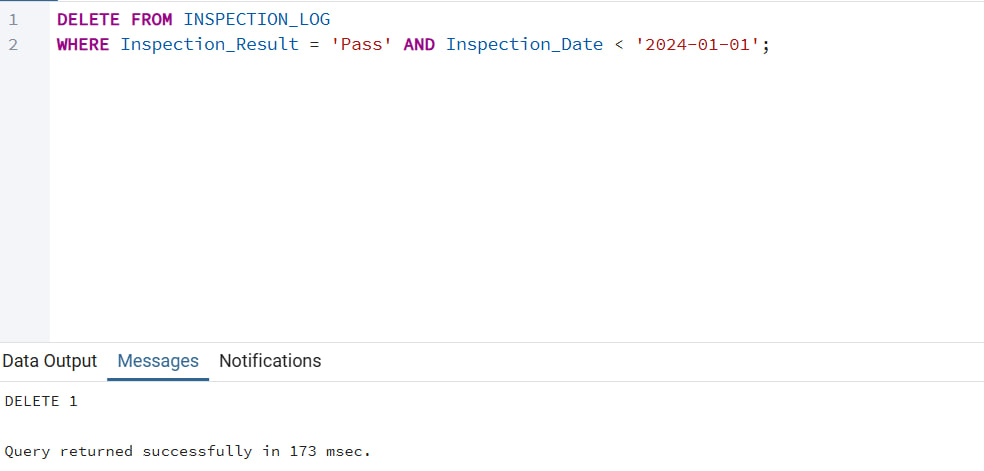

* **אחרי המחיקה:**
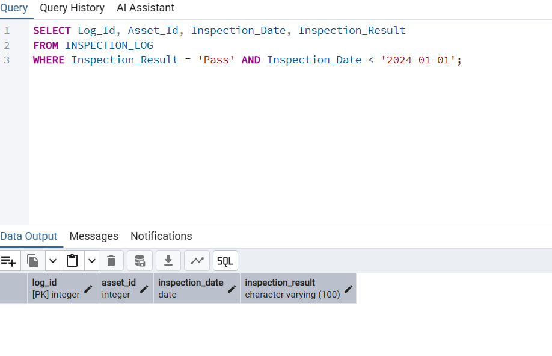

 
❌ מחיקה 2: הסרת מיקומים (Locations) ללא נכסים
תיאור השאילתה: השאילתה מוחקת מטבלת המיקומים (Locations) אזורים במלון שאין בהם אף נכס שדורש תחזוקה. הבדיקה מתבצעת באמצעות תת-שאילתה שמוודאת שה-Location_ID אינו מופיע כלל בטבלת הנכסים (Assets). זה מנקה אזורים מבוטלים או שגיאות הקלדה שנעשו בעת הגדרת המלון..
**קוד השאילתה:**
```sql
DELETE FROM LOCATIONS
WHERE Location_ID NOT IN (
    SELECT DISTINCT Location_ID 
    FROM ASSETS 
    WHERE Location_ID IS NOT NULL
);
```
**תיעוד הביצוע**
**לפני המחיקה:**
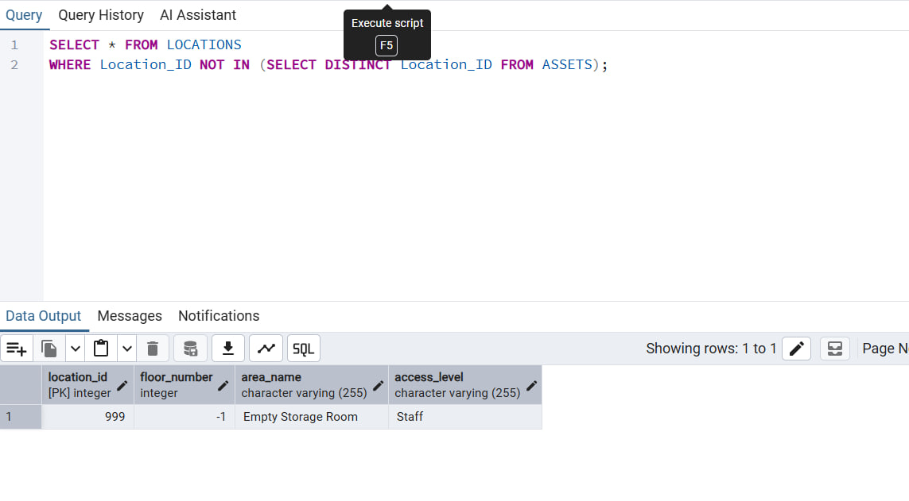

**הרצת הפקודה:**
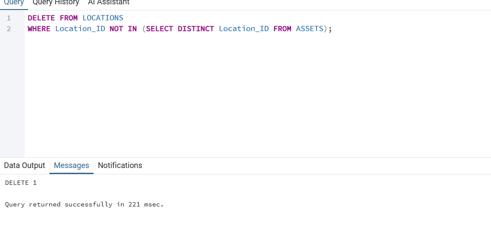

* **אחרי המחיקה:**
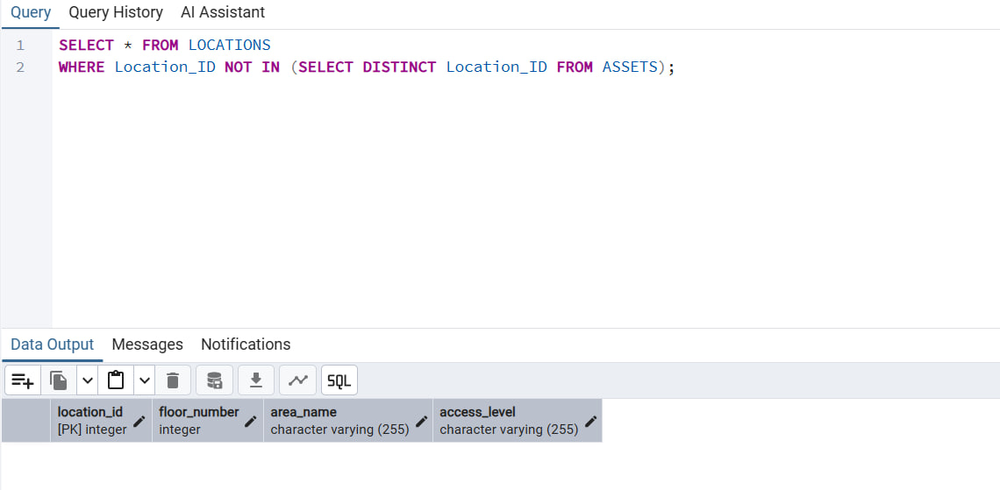

  
❌ מחיקה 3: הסרת ספקים (Vendors) לא פעילים
תיאור השאילתה: בדומה למחיקת המיקומים, שאילתה זו עוברת על טבלת הספקים ומוחקת ספקים שאינם מקושרים לאף נכס קיים במלון. הסרת ספקים שלא מספקים שירות למלון שומרת על רשימת קשר ממוקדת ויעילה עבור צוות הרכש והתחזוקה..
**קוד השאילתה:**
```sql
DELETE FROM VENDORS
WHERE Vendor_ID NOT IN (
    SELECT DISTINCT Vendor_ID 
    FROM ASSETS 
    WHERE Vendor_ID IS NOT NULL
);
```
**תיעוד הביצוע**
**לפני המחיקה:**
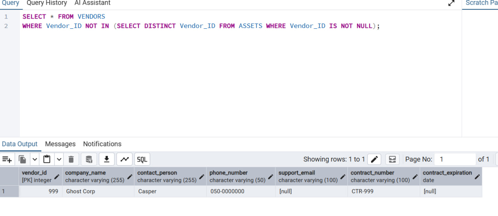

**הרצת הפקודה:**
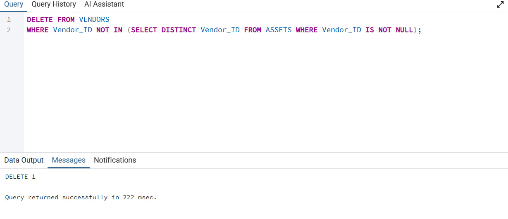

* **אחרי המחיקה:**
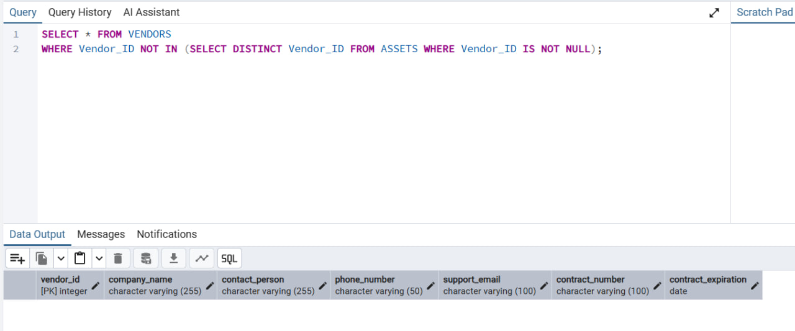

## 🛡️ אילוצים (Constraints)

בחלק זה הוספנו הגנות ברמת בסיס הנתונים כדי למנוע הזנת נתונים לא הגיוניים או שגויים, השומרים על שלמות ואמינות המידע (Data Integrity).

### אילוץ 1: בדיקת תאריכים הגיוניים (תאריך סיום לעומת פתיחה)
**תיאור השינוי:** הוספנו אילוץ לטבלת `MAINTENANCE_TICKETS` שמוודא שתאריך סגירת התקלה (`Resolved_At`) לא יכול להיות מוקדם יותר מתאריך פתיחת התקלה (`Opened_At`). 

**קוד יצירת האילוץ (`ALTER TABLE`):**
```sql
ALTER TABLE MAINTENANCE_TICKETS
ADD CONSTRAINT chk_ticket_dates 
CHECK (Resolved_At IS NULL OR Resolved_At >= Opened_At);
```

**ניסיון הפרת האילוץ (הזנת תאריך סגירה שקודם לפתיחה):**

```sql
INSERT INTO MAINTENANCE_TICKETS (Ticket_ID, Asset_Id, Staff_Id, Issue_Description, Opened_At, Resolved_At, Urgency_Level, Ticket_Status) 
VALUES (9001, (SELECT MIN(Asset_Id) FROM ASSETS), (SELECT MIN(Staff_Id) FROM STAFF), 'Time Travel Error', '2026-05-10', '2026-05-01', 'Low', 'Closed');
```

**צילום שגיאת הריצה:**
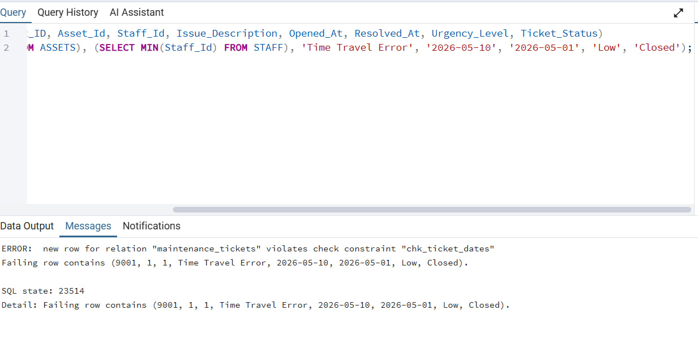


### אילוץ 2: בדיקת טווח קומות הגיוני במלון
**תיאור השינוי:** הוספנו אילוץ לטבלת LOCATIONS שמוודא שמספר הקומה (Floor_Number) חייב להיות בטווח ההגיוני של המבנה (בין קומה מינוס 2 לחניון, ועד קומה 50).
**קוד יצירת האילוץ (`ALTER TABLE`):**
```sql
ALTER TABLE LOCATIONS
ADD CONSTRAINT chk_floor_range 
CHECK (Floor_Number >= -2 AND Floor_Number <= 50);
```

**ניסיון הפרת האילוץ (הזנת קומה 100 שאינה קיימת):**

```sql
INSERT INTO LOCATIONS (Location_ID, Floor_Number, Area_Name, Access_Level) 
VALUES (9002, 100, 'Rooftop Antenna', 'Staff');
```


**צילום שגיאת הריצה:**
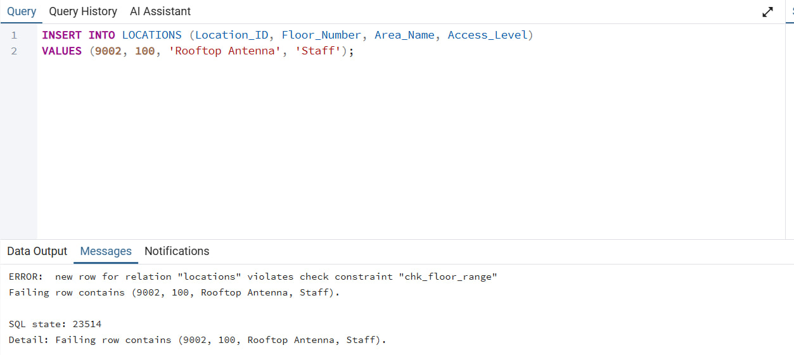


### אילוץ 3: הגבלת ערכי הסטטוס של תקלה
**תיאור השינוי:** הוספנו אילוץ לטבלת MAINTENANCE_TICKETS המגביל את עמודת מצב התקלה (Ticket_Status) לערכים מוגדרים מראש בלבד, כדי למנוע טעויות הקלדה.
**קוד יצירת האילוץ (`ALTER TABLE`):**
```sql
ALTER TABLE MAINTENANCE_TICKETS
ADD CONSTRAINT chk_status_values 
CHECK (Ticket_Status IN ('Open', 'In Progress', 'Closed', 'Cancelled'));
```

**ניסיון הפרת האילוץ (הזנהזנת סטטוס מומצא בשם 'Magic'):**

```sql
INSERT INTO MAINTENANCE_TICKETS (Ticket_ID, Asset_Id, Staff_Id, Issue_Description, Opened_At, Resolved_At, Urgency_Level, Ticket_Status) 
VALUES (9003, (SELECT MIN(Asset_Id) FROM ASSETS), (SELECT MIN(Staff_Id) FROM STAFF), 'Test Status', CURRENT_DATE, NULL, 'Low', 'Magic');
```


**צילום שגיאת הריצה:**
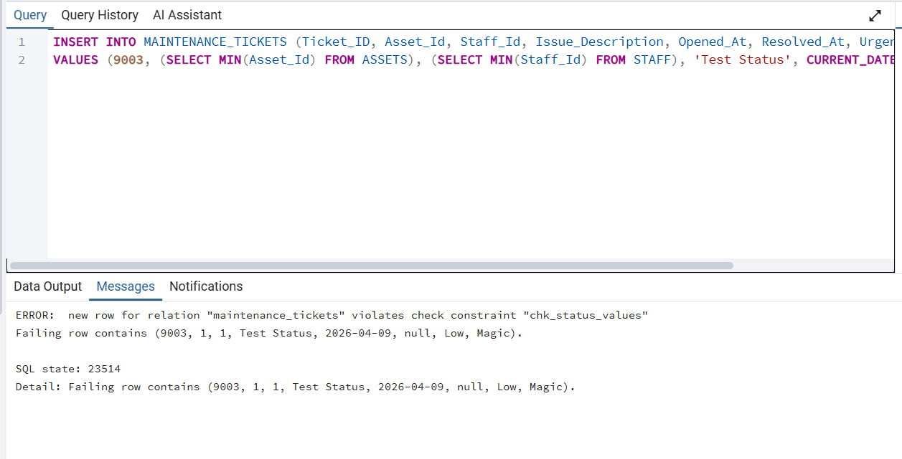


### אילוץ 4: ההגבלת רמות הדחיפות (Urgency)
**תיאור השינוי:** בדומה לאילוץ הסטטוס, הוספנו אילוץ לטבלת MAINTENANCE_TICKETS המגביל את עמודת רמת הדחיפות (Urgency_Level) לסולם ערכים קבוע ומורשה.
**קוד יצירת האילוץ (ALTER TABLE):**
```sql
ALTER TABLE MAINTENANCE_TICKETS
ADD CONSTRAINT chk_urgency_level 
CHECK (Urgency_Level IN ('Low', 'Medium', 'High', 'Urgent'));
```

**ניסיון הפרת האילוץ (הזנת רמת דחיפות שאינה ברשימה - 'Super Fast'):**

```sql
INSERT INTO MAINTENANCE_TICKETS (Ticket_ID, Asset_Id, Staff_Id, Issue_Description, Opened_At, Resolved_At, Urgency_Level, Ticket_Status) 
VALUES (9004, (SELECT MIN(Asset_Id) FROM ASSETS), (SELECT MIN(Staff_Id) FROM STAFF), 'Test Urgency', CURRENT_DATE, NULL, 'Super Fast', 'Open');
```


**צילום שגיאת הריצה:**
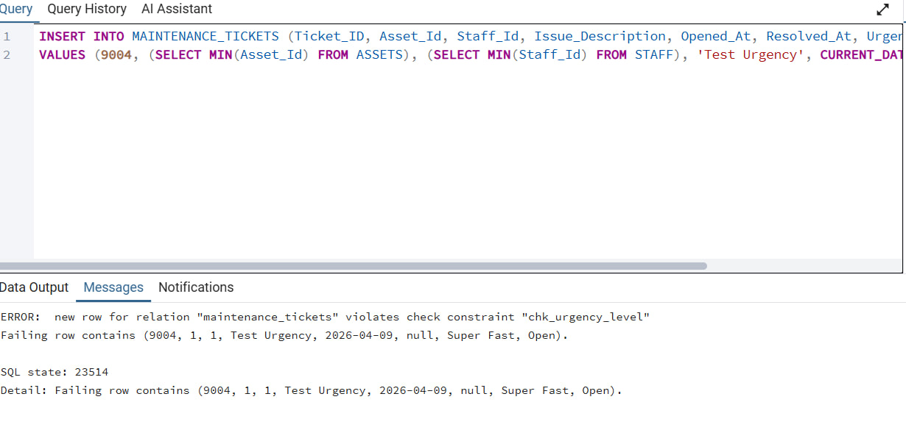


## 💾 ניהול עסקאות (Transactions)

בשלב זה הדגמנו את היכולת של בסיס הנתונים לנהל עסקאות בצורה בטוחה, המאפשרת ביטול פעולות שבוצעו בטעות או שמירה סופית שלהן.

### חלק 1: ביטול פעולה בעזרת ROLLBACK
**תיאור:** ביצענו מחיקה של כל הרשומות ביומן הבדיקות (`INSPECTION_LOG`) בתוך עסקה פעילה. לאחר מכן, השתמשנו בפקודת `ROLLBACK` כדי לבטל את המחיקה ולהחזיר את המצב לקדמותו, מה שמוכיח שהנתונים לא אבדו למרות פקודת המחיקה.

* **מצב 1: הטבלה לפני המחיקה (קיימים נתונים):**
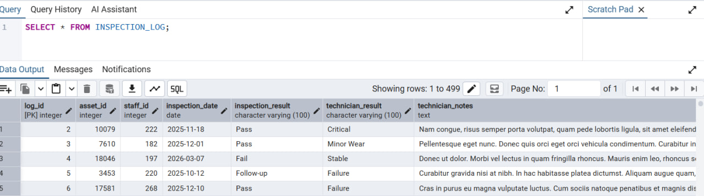

* **מצב 2: בתוך העסקה (הנתונים נמחקו זמנית - טבלה ריקה):**
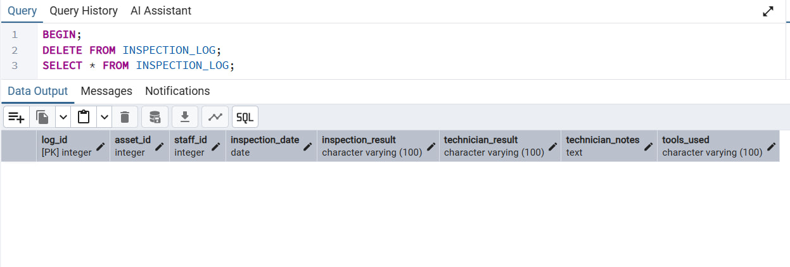

* **מצב 3: לאחר ROLLBACK (הנתונים שוחזרו במלואם):**
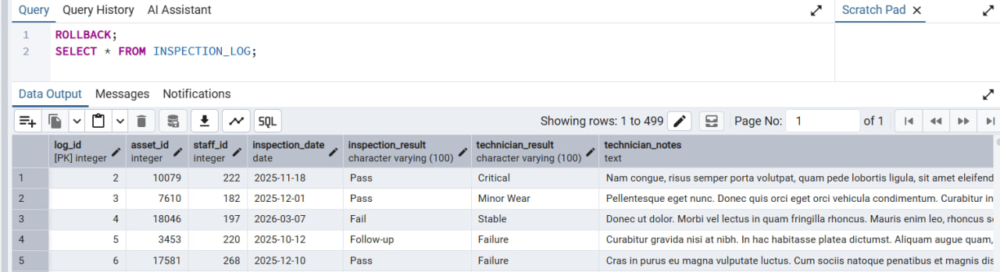

---

### חלק 2: שמירת שינויים בעזרת COMMIT
**תיאור:** ביצענו עדכון של פרטי איש קשר אצל ספק מסוים וסגרנו את העסקה בעזרת `COMMIT`. לאחר השמירה, ניסינו לבצע `ROLLBACK` כדי להראות שברגע שהעסקה נחתמה ובוצע אישור סופי, השינוי הופך לקבוע בבסיס הנתונים ולא ניתן לבטלו עוד.

* **ביצוע העדכון והשמירה הסופית (COMMIT):**
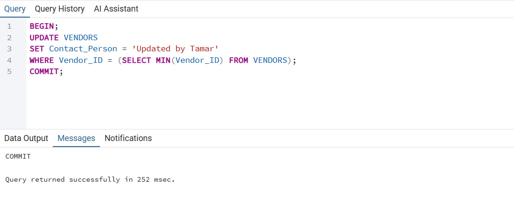

* **בדיקה לאחר ניסיון ביטול (השינוי נשאר קבוע למרות ה-ROLLBACK):**
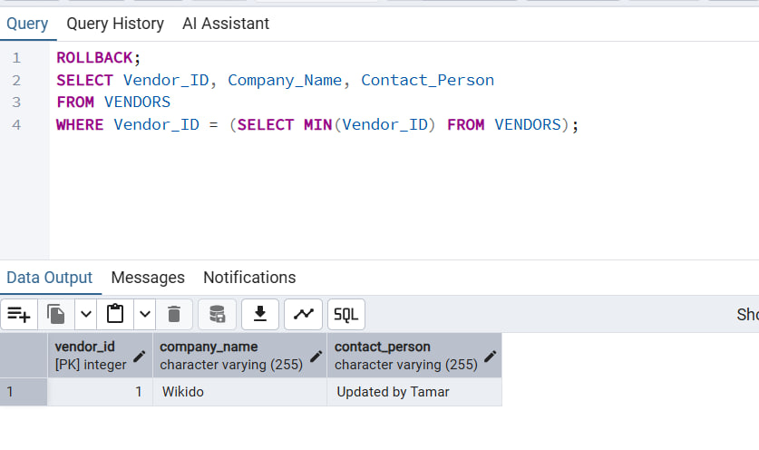


## שלב ג': אינטגרציה ומבטים
בשלב זה ביצענו הינדוס לאחור לבסיס הנתונים של אגף משאבי אנוש (HR), שילבנו אותו עם מערכת התחזוקה הקיימת שלנו, ופיתחנו מבטים (Views) ייעודיים לניתוח הנתונים המשולבים.

---

## 1. הינדוס לאחור - אגף משאבי אנוש
שחזרנו את תרשים הישויות-קשרים (ERD) מהסכימה הלוגית שקיבלנו.

### אלגוריתם הינדוס לאחור
* **זיהוי ישויות**: מיפוי טבלאות לישויות.
* **זיהוי תכונות**: המרת עמודות לתכונות עם זיהוי מפתחות.
* **זיהוי קשרים**: שימוש במפתחות זרים להגדרת קשרים.
* **קביעת קרדינליות**: קביעת יחסי 1:N ו-N:M.

**תיעוד חזותי:**
* **DSD של האגף החדש**: .png)
* **ERD של האגף החדש**: .png)

---

## 2. אינטגרציה
ביצענו אינטגרציה בין מערכת התחזוקה למערכת ה-HR. הוספנו עמודת `employeeid` לטבלת ה-`STAFF` כדי לקשר בין אנשי הצוות הטכני לזהותם כעובדי מלון.

**תיעוד חזותי:**
* **ERD משולב**: .png)
* **DSD לאחר אינטגרציה**: .png)

---

## 3. מבטים (Views) ושאילתות

### מבט 1: נקודת מבט תשתיות (`asset_full_details`)
**תיאור:** מבט המרכז את פרטי הנכסים, מיקומם המדויק ופרטי הספק האחראי עליהם.

**שליפת נתונים (`SELECT *`):**
| Asset_Id | Asset_Name | Asset_Category | Status | Area_Name | Floor | Company_Name |
| :--- | :--- | :--- | :--- | :--- | :--- | :--- |
| 101 | AC Unit | HVAC | Active | Lobby | 0 | CoolAir Ltd |
| 102 | Elevator A | Transport | Active | North Wing | 1-10 | LiftMaster |
| 103 | Generator | Power | Active | Basement | -1 | VoltEdge |
| 104 | Fridge Ind. | Kitchen | Maintenance | Main Kitchen | 0 | ChillTech |
| 105 | Boiler 1 | Plumbing | Active | Roof | 12 | FlowSystems |
| 106 | CCTV Cam 4 | Security | Active | Parking | -1 | SecureEye |
| 107 | Fire Pump | Safety | Active | Pump Room | -1 | FireGuard |
| 108 | Washing Mach | Laundry | Active | Laundry Room | 0 | WashPro |
| 109 | Router R1 | IT | Active | Server Room | 3 | NetConnect |
| 110 | Pool Filter | Leisure | Inactive | Pool Area | 0 | AquaClear |

**שאילתות על המבט:**
1. **כל הנכסים הפעילים:**
   * **קוד:** `SELECT * FROM asset_full_details WHERE Status = 'Active';`
   * **פלט:** רשימת כל הנכסים למעט Fridge (בתיקון) ו-Pool Filter (לא פעיל).
2. **חוזים שפגים בשנה הקרובה:**
   * **קוד:** `SELECT Asset_Name, Company_Name, Contract_Expiration FROM asset_full_details WHERE Contract_Expiration < CURRENT_DATE + INTERVAL '1 year';`
   * **פלט:** הצגת הנכסים שהספקים שלהם דורשים חידוש חוזה בקרוב.

---

### מבט 2: נקודת מבט משאבי אנוש (`employee_full_details`)
**תיאור:** ריכוז נתוני עובדים הכולל מחלקה, תפקיד ושכר בסיס.

**שליפת נתונים (`SELECT *`):**
| employeeid | firstname | lastname | departmentname | roletitle | basesalary |
| :--- | :--- | :--- | :--- | :--- | :--- |
| 1 | David | Cohen | Maintenance | Senior Technician | 7500 |
| 2 | Sarah | Levi | HR | HR Manager | 9000 |
| 3 | Itamar | Israeli | Maintenance | Electrician | 6200 |
| 4 | Maya | Brown | Reception | Clerk | 5200 |
| 5 | Ariel | Dayan | Maintenance | Plumber | 5800 |
| 6 | Noa | Katz | Finance | Accountant | 8500 |
| 7 | Daniel | Roz | Kitchen | Head Chef | 11000 |
| 8 | Adi | Gabay | Maintenance | Junior Technician | 4800 |
| 9 | Yossi | Shalom | Housekeeping | Supervisor | 5500 |
| 10 | Omer | Peretz | Security | Guard | 5100 |

**שאילתות על המבט:**
1. **עובדים פעילים:**
   * **קוד:** `SELECT * FROM employee_full_details WHERE employmentstatus = 'Active';`
   * **פלט:** רשימת כל עובדי המלון המועסקים כעת.
2. **עובדים עם שכר מעל 5000:**
   * **קוד:** `SELECT firstname, lastname, roletitle, basesalary FROM employee_full_details WHERE basesalary > 5000;`
   * **פלט:** רשימת עובדים (למעט Adi Gabay שמרוויח 4800).

---

### מבט 3: מבט משולב (`staff_employee_details`)
**תיאור:** קישור בין צוות התחזוקה (מומחיות) לבין זהותם כעובדים במערכת ה-HR.

**שליפת נתונים (`SELECT *`):**
| Staff_ID | First_Name | Last_Name | Expertise | employeeid |
| :--- | :--- | :--- | :--- | :--- |
| 1 | David | Cohen | HVAC | 1 |
| 2 | Itamar | Israeli | Electricity | 3 |
| 3 | Ariel | Dayan | Plumbing | 5 |
| 4 | Adi | Gabay | General | 8 |
| 5 | Efrat | Sando | IT | 11 |

**שאילתות על המבט:**
1. **טכנאים המקושרים למערכת ה-HR:**
   * **קוד:** `SELECT * FROM staff_employee_details;`
   * **פלט:** כל 5 אנשי הצוות המופיעים בטבלה לעיל.
2. **טכנאים לפי מומחיות:**
   * **קוד:** `SELECT First_Name, Last_Name, Expertise FROM staff_employee_details ORDER BY Expertise;`
   * **פלט:** רשימה ממוינת (Electricity, General, HVAC, IT, Plumbing).

---

## 4. קבצי הפרויקט
* **Integrate.sql**: פקודות ליצירת טבלאות ואינטגרציה.
* **Views.sql**: פקודות ליצירת המבטים והשאילתות.
* **backup3**: קובץ הגיבוי המעודכן.

# שלב ד' - תכנות בסיס הנתונים (PL/pgSQL)
## 📞 חלק א': פונקציות (Functions)
### 1. פונקציית חישוב ימי תחזוקה לפי מיקום
**שם הפונקציה:** calculate_location_maintenance_days
**אלמנטים שמומשו בקוד:** Explicit Cursor, Record, Loop, IF-ELSE, Exception Handling.

**תיאור מילולי:**
הפונקציה מקבלת מזהה מיקום (Location_ID) ומחזירה את סך ימי העבודה המצטברים שהושקעו (או מושקעים כעת) בפניות תחזוקה באותו מיקום. הפונקציה מוגנת על ידי מנגנון חריגות המבצע בדיקה מקדימה בטבלת המיקומים, וזורק שגיאה מותאמת אישית (e_location_not_found) במידה והמיקום לא קיים במערכת. היא עושה שימוש ב-Explicit Cursor המבצע JOIN בין טבלת הנכסים לטבלת הפניות, ורצה בלולאה על גבי משתנה RECORD. בעזרת הסתעפות IF-ELSE היא מחשבת הפרשי ימים: עבור פניה סגורה מחושב הזמן שלקח לסגור אותה, ועבור פניה פתוחה מחושב הזמן שעבר מאז שנפתחה ועד היום (CURRENT_DATE).  

**קוד המקור:**
```sql
CREATE OR REPLACE FUNCTION calculate_location_maintenance_days(p_location_id INT)
RETURNS INT AS $$
DECLARE
    ticket_cursor CURSOR FOR 
        SELECT t.Opened_At, t.Resolved_At, t.Ticket_Status
        FROM MAINTENANCE_TICKETS t
        JOIN ASSETS a ON t.Asset_Id = a.Asset_Id
        WHERE a.Location_Id = p_location_id;
        
    v_ticket_record RECORD;
    v_total_days INT := 0;
    v_location_exists INT;
    v_days_spent INT;
    e_location_not_found EXCEPTION;
BEGIN
    SELECT COUNT(*) INTO v_location_exists FROM LOCATIONS WHERE Location_ID = p_location_id;
    IF v_location_exists = 0 THEN
        RAISE e_location_not_found;
    END IF;
    
    OPEN ticket_cursor;
    LOOP
        FETCH ticket_cursor INTO v_ticket_record;
        EXIT WHEN NOT FOUND;
        
        IF v_ticket_record.Resolved_At IS NOT NULL THEN
            v_days_spent := v_ticket_record.Resolved_At - v_ticket_record.Opened_At;
        ELSE
            v_days_spent := CURRENT_DATE - v_ticket_record.Opened_At;
        END IF;
        
        v_total_days := v_total_days + v_days_spent;
    END LOOP;
    CLOSE ticket_cursor;
    
    RETURN v_total_days;

EXCEPTION
    WHEN e_location_not_found THEN
        RAISE EXCEPTION 'שגיאה בפונקציה: המיקום עם מזהה % אינו קיים במלון.', p_location_id;
    WHEN OTHERS THEN
        RAISE EXCEPTION 'התרחשה שגיאה בלתי צפויה: %', SQLERRM;
END;
$$ LANGUAGE plpgsql;
```


# 2. פונקציית שליפת פניות דחופות (החזרת Ref Cursor)
**שם הפונקציה:** get_urgent_tickets_curso
**אלמנטים שמומשו בקוד:** Ref Cursor (החזרת מצביע דינמי), IF, Validation.

**תיאור מילולי:**
פונקציה זו מקבלת כקלט רמת דחיפות מבוקשת (p_urgency_level) ומחזירה מצביע דינמי מסוג REFCURSOR לשאילתה מורכבת המקשרת שלוש טבלאות שונות (MAINTENANCE_TICKETS, ASSETS, STAFF). הפונקציה כוללת בדיקת תקינות קלט המונעת הזנת ערכים ריקים. ה-Ref Cursor מוחזר פתוח לתוכנית הראשית, מה שמאפשר לה לרוץ עליו בלולאה חיצונית, לשלוף את הנתונים המעודכנים ולהדפיסם בזמן אמת.    

**קוד המקור:**
```sql
CREATE OR REPLACE FUNCTION get_urgent_tickets_cursor(p_urgency_level VARCHAR)
RETURNS REFCURSOR AS $$
DECLARE
    v_ref_cursor REFCURSOR := 'urgent_tickets_cur';
BEGIN
    IF p_urgency_level IS NULL OR p_urgency_level = '' THEN
        RAISE EXCEPTION 'שגיאה בפונקציה: רמת הדחיפות שסופקה אינה תקינה או ריקה.';
    END IF;

    OPEN v_ref_cursor FOR
        SELECT t.Ticket_ID, a.Asset_Name, t.Issue_Description, 
               s.First_Name || ' ' || s.Last_Name AS Assigned_Technician, t.Opened_At
        FROM MAINTENANCE_TICKETS t
        JOIN ASSETS a ON t.Asset_Id = a.Asset_Id
        JOIN STAFF s ON t.Staff_Id = s.Staff_ID
        WHERE t.Ticket_Status = 'Open' 
          AND t.Urgency_Level = p_urgency_level;

    RETURN v_ref_cursor;
END;
$$ LANGUAGE plpgsql;
```
## ⚙️ חלק ב': פרוצדורות (Procedures)
# 1. פרוצדורה לשיוך מחדש של פניות חורגות
**שם הפרוצדורה:** reassign_overdue_tickets
**אלמנטים שמומשו בקוד:** Implicit Cursor, Loop, DML (UPDATE), IF-ELSE, Exceptions.

**תיאור מילולי:**
פרוצדורה זו נועדה לטפל בפניות פתוחות שחורגות מזמן הטיפול המוגדר (פתוחות למעלה מ-3 ימים) ולשייך אותן מחדש לטכנאים מומחים. הפרוצדורה משתמשת ב-Implicit Cursor בתוך לולאת FOR כדי לעבור על כל הפניות החורגות. עבור כל פנייה, היא מחפשת בטבלת STAFF טכנאי ששדה המומחיות שלו (Expertise) תואם בדיוק לקטגוריית הנכס המקולקל (Asset_Category). במידה ונמצא טכנאי מתאים, מבוצעת פקודת DML (UPDATE) המשייכת את הפנייה אליו ומשדרגת את רמת הדחיפות ל-'High'. במידה ולא נמצא מומחה, המערכת מייצרת התראה (NOTICE) מבלי לעצור את הריצה.  

**קוד המקור:**

```sql
CREATE OR REPLACE PROCEDURE reassign_overdue_tickets()
AS $$
DECLARE
    v_expert_id INT;
    v_updated_count INT := 0;
BEGIN
    FOR v_ticket IN 
        SELECT t.Ticket_ID, a.Asset_Category, t.Opened_At
        FROM MAINTENANCE_TICKETS t
        JOIN ASSETS a ON t.Asset_Id = a.Asset_Id
        WHERE t.Ticket_Status = 'Open' 
          AND t.Opened_At < CURRENT_DATE - 3
    LOOP
        
        SELECT Staff_ID INTO v_expert_id
        FROM STAFF
        WHERE Expertise = v_ticket.Asset_Category
        LIMIT 1;

        IF v_expert_id IS NOT NULL THEN
            
            UPDATE MAINTENANCE_TICKETS
            SET Staff_Id = v_expert_id,
                Urgency_Level = 'High'
            WHERE Ticket_ID = v_ticket.Ticket_ID;
            
            v_updated_count := v_updated_count + 1;
        ELSE
            RAISE NOTICE 'התראה: לא נמצא טכנאי עם מומחיות מתאימה (%) עבור פנייה %', 
                         v_ticket.Asset_Category, v_ticket.Ticket_ID;
        END IF;
        
    END LOOP;

    RAISE NOTICE 'הפרוצדורה הסתיימה בהצלחה. שויכו מחדש % פניות תחזוקה.', v_updated_count;

EXCEPTION
    WHEN OTHERS THEN
        RAISE EXCEPTION 'שגיאה פרוצדורלית בעת שיוך מחדש של פניות: %', SQLERRM;
END;
$$ LANGUAGE plpgsql;
```

# 2. פרוצדורה לעיבוד כשלונות ספקים וקניסתם
**שם הפרוצדורה:** process_vendor_failures
**אלמנטים שמומשו בקוד:**  Parametric Explicit Cursor, Record, Loop, IF-ELSIF-ELSE, Multiple DML Updates, Exceptions.  

**תיאור מילולי:**
פרוצדורה זו מנתחת את יומן הבדיקות של המלון ומענישה אוטומטית ספקים שרמת הכשלים של הנכסים שלהם חורגת מהמותר. הפרוצדורה מגדירה Explicit Cursor המקבל פרמטר (סטטוס הכישלון לבדיקה) ומבצע אגרגציה (COUNT ו-GROUP BY) על פני שלוש טבלאות. בלולאה ידנית, הפרוצדורה בודקת את חומרת הכשלים של כל ספק באמצעות מבנה IF-ELSIF מורכב: עבור ספק עם 5 כשלים ומעלה, מבוצעות שתי פקודות DML (UPDATE) – אחת המקצרת את תוקף החוזה שלו בטבלת VENDORS ל-30 יום, והשנייה מקפיאה את כל נכסיו בטבלת ASSETS לסטטוס 'Under Review'. עבור ספק עם 2-4 כשלים, סטטוס נכסיו מעודכן ל-'Requires Action' בלבד. 

**קוד המקור:**

```sql
CREATE OR REPLACE PROCEDURE process_vendor_failures(p_failed_status_text VARCHAR)
AS $$
DECLARE
    vendor_cursor CURSOR(p_status VARCHAR) FOR
        SELECT v.Vendor_Id, v.Company_Name, COUNT(l.Log_Id) AS fail_count
        FROM VENDORS v
        JOIN ASSETS a ON v.Vendor_Id = a.Vendor_Id
        JOIN INSPECTION_LOG l ON a.Asset_Id = l.Asset_Id
        WHERE l.Inspection_Result = p_status
        GROUP BY v.Vendor_Id, v.Company_Name;

    v_vendor_rec RECORD;
    v_penalty_date DATE := CURRENT_DATE + INTERVAL '30 days';
BEGIN
    IF p_failed_status_text IS NULL OR p_failed_status_text = '' THEN
        RAISE EXCEPTION 'שגיאה: סטטוס הכישלון שסופק לפרוצדורה ריק או לא תקין.';
    END IF;

    OPEN vendor_cursor(p_failed_status_text);
    LOOP
        FETCH vendor_cursor INTO v_vendor_rec;
        EXIT WHEN NOT FOUND;
        
        IF v_vendor_rec.fail_count >= 5 THEN
            UPDATE VENDORS SET Contract_Expiration = v_penalty_date WHERE Vendor_Id = v_vendor_rec.Vendor_Id;
            UPDATE ASSETS SET Status = 'Under Review' WHERE Vendor_Id = v_vendor_rec.Vendor_Id;
            
            RAISE NOTICE 'ספק חריג: חוזה החברה % קוצר עקב % כשלים, ונכסיה הוקפאו.', 
                         v_vendor_rec.Company_Name, v_vendor_rec.fail_count;
                         
        ELSIF v_vendor_rec.fail_count >= 2 THEN
            UPDATE ASSETS SET Status = 'Requires Action' WHERE Vendor_Id = v_vendor_rec.Vendor_Id;
              
            RAISE NOTICE 'התראה: ספק % צבר % כשלים. סטטוס נכסיו עודכן ל-Requires Action.', 
                         v_vendor_rec.Company_Name, v_vendor_rec.fail_count;
        END IF;
        
    END LOOP;
    CLOSE vendor_cursor;

EXCEPTION
    WHEN OTHERS THEN
        RAISE EXCEPTION 'התרחשה שגיאה פרוצדורלית בעיבוד כשלונות הספקים: %', SQLERRM;
END;
$$ LANGUAGE plpgsql;
```

##⚡ חלק ג': טריגרים (Triggers)
# 1. טריגר תיעוד אוטומטי ביומן הבדיקות (AFTER UPDATE)
**טבלה מקושרת:** MAINTENANCE_TICKETS
**זמן הפעלה:** AFTER UPDATE
***אלמנטים שמומשו בקוד:** IF (תנאי שינוי סטטוס), DML (INSERT)
**תיאור מילולי:** 
הטריגר מופעל אוטומטית מיד לאחר ביצוע פקודת UPDATE על טבלת הפניות. הוא בודק באמצעות הסתעפות האם סטטוס הפנייה השתנה ל-'Resolved' (טופלה) בהשוואה למצבה הקודם (OLD מול NEW). במידה והתנאי מתקיים, הטריגר מחשב את ה-ID הבא הפנוי ומבצע פקודת DML (INSERT) המזינה שורת בדיקה חדשה לטבלת INSPECTION_LOG עם פרטי הטכנאי, הנכס והערה אוטומטית, ובכך מבטיח תיעוד היסטורי אמין וחסין שינויים במלון.

**קוד מקור:**
```sql

CREATE OR REPLACE FUNCTION log_resolved_ticket_func()
RETURNS TRIGGER AS $$
DECLARE
    v_next_log_id INT;
BEGIN
    IF NEW.Ticket_Status = 'Resolved' AND OLD.Ticket_Status IS DISTINCT FROM NEW.Ticket_Status THEN
        
        SELECT COALESCE(MAX(Log_Id), 0) + 1 INTO v_next_log_id FROM INSPECTION_LOG;
        
        
        INSERT INTO INSPECTION_LOG (
            Log_Id, Asset_Id, Staff_Id, Inspection_Date, 
            Inspection_Result, Technician_Result, Technician_Notes, Tools_Used
        ) VALUES (
            v_next_log_id, NEW.Asset_Id, NEW.Staff_Id, CURRENT_DATE,
            'System Certified', 'Success', 
            'בדיקה אוטומטית: הפנייה נסגרה בהצלחה. מזהה פנייה: ' || NEW.Ticket_ID,
            'Automated System'
        );
    END IF;
    RETURN NEW;
END;
$$ LANGUAGE plpgsql;

CREATE OR REPLACE TRIGGER trg_log_resolved_ticket
AFTER UPDATE ON MAINTENANCE_TICKETS
FOR EACH ROW
EXECUTE FUNCTION log_resolved_ticket_func();

```
# 2. טריגר חסימת שלמות נתונים והקפאת נכסים (BEFORE INSERT OR UPDATE)
**טבלה מקושרת:** MAINTENANCE_TICKETS
**זמן הפעלה:** BEFORE INSERT OR UPDATE
***אלמנטים שמומשו בקוד:** הוצאת שגיאות (RAISE EXCEPTION), IF מורכב, שליפת נתונים מצלבת
**תיאור מילולי:**
טריגר הגנתי זה מופעל לפני כתיבת שורה חדשה או מעודכנת לטבלת הפניות ומבצע שתי בדיקות שלמות קריטיות:  הוא מוודא שתאריך הסגירה (Resolved_At) אינו מוקדם מתאריך הפתיחה (Opened_At), ובמידה וכן – הוא בולם את הפעולה וזורק שגיאה מפורשת.  הוא שולף את סטטוס הנכס הרלוונטי מטבלת ASSETS, ובמידה והמשתמש מנסה לפתוח פנייה דחופה (Urgent) עבור נכס שנמצא כעת בהקפאה או בבדיקת ספק (Under Review), הטריגר זורק Exception וחוסם את הרישום בבסיס הנתונים כדי למנוע כפל משימות וטעויות אנוש.  

**קוד מקור:**
```sql


CREATE OR REPLACE FUNCTION validate_ticket_constraints_func()
RETURNS TRIGGER AS $$
DECLARE
    v_asset_status VARCHAR(50);
BEGINים
    IF NEW.Resolved_At IS NOT NULL AND NEW.Resolved_At < NEW.Opened_At THEN
        RAISE EXCEPTION 'שגיאה: תאריך סגירת הפנייה (%) אינו יכול להיות מוקדם מתאריך פתיחתה (%).', 
                        NEW.Resolved_At, NEW.Opened_At;
    END IF;
    SELECT Status INTO v_asset_status FROM ASSETS WHERE Asset_Id = NEW.Asset_Id;

    IF NEW.Urgency_Level = 'Urgent' AND v_asset_status = 'Under Review' THEN
        RAISE EXCEPTION 'חסימה: לא ניתן לפתוח פנייה דחופה (Urgent) עבור נכס הנמצא בסטטוס Under Review.';
    END IF;

    RETURN NEW;
END;
$$ LANGUAGE plpgsql;
CREATE OR REPLACE TRIGGER trg_validate_ticket_constraints
BEFORE INSERT OR UPDATE ON MAINTENANCE_TICKETS
FOR EACH ROW
EXECUTE FUNCTION validate_ticket_constraints_func();
```
## 🖥️ חלק ד': תוכניות ראשיות (Main Programs)
# 1. תוכנית ראשית מספר 1
**תוכניות מזומנות:** פרוצדורה reassign_overdue_tickets + פונקציה calculate_location_maintenance_days.  
**קוד מקור:**

```sql
DO $$
DECLARE
    v_target_location_id INT := 1; 
    v_total_days INT;
BEGIN
    RAISE NOTICE '==================================================';
    RAISE NOTICE 'הפעלה: מתחיל הרצת תוכנית ראשית מספר 1';
    RAISE NOTICE '==================================================';

    RAISE NOTICE 'שלב א: מריץ פרוצדורה לאיתור ושיוך מחדש של פניות חורגות...';
    CALL reassign_overdue_tickets();
    
    RAISE NOTICE '--------------------------------------------------';

    RAISE NOTICE 'שלב ב: מריץ פונקציה לחישוב סך ימי התחזוקה במיקום מזהה %...', v_target_location_id;
    v_total_days := calculate_location_maintenance_days(v_target_location_id);
    
    RAISE NOTICE 'סיכום: סך כל ימי העבודה שהושקעו במיקום % הוא: % ימים.', 
                 v_target_location_id, v_total_days;
    RAISE NOTICE '==================================================';
END $$;
```

# 2. תוכנית ראשית מספר 2
**תוכניות מזומנות:** פרוצדורה process_vendor_failures + פונקציה get_urgent_tickets_cursor.
**טכניקה מיוחדת:** יקון וסריקת Ref Cursor דינמי באמצעות לולאה חיצונית ופקודות FETCH.
**קוד מקור:**
```sql
DO $$
DECLARE
    v_urgent_tickets_cursor REFCURSOR;
    
    v_ticket_id INT;
    v_asset_name VARCHAR(255);
    v_description VARCHAR(255);
    v_technician_name VARCHAR(255);
    v_opened_date DATE;
    
    v_counter INT := 0;
BEGIN
    RAISE NOTICE '==================================================';
    RAISE NOTICE 'הפעלה: מתחיל הרצת תוכנית ראשית מספר 2';
    RAISE NOTICE '==================================================';

    
    RAISE NOTICE 'שלב א: מריץ פרוצדורה לעדכון ספקים שנכשלו בבדיקות...';
    CALL process_vendor_failures('Failed');
    
    RAISE NOTICE '--------------------------------------------------';


    RAISE NOTICE 'שלב ב: קורא לפונקציה לקבלת Ref Cursor עבור פניות דחופות...';
    v_urgent_tickets_cursor := get_urgent_tickets_cursor('High');

    RAISE NOTICE 'שלב ג: מתחיל סריקה והדפסה של הפניות מתוך ה-Ref Cursor:';
    RAISE NOTICE '--------------------------------------------------';
    
    LOOP
        FETCH v_urgent_tickets_cursor INTO v_ticket_id, v_asset_name, v_description, v_technician_name, v_opened_date;
        EXIT WHEN NOT FOUND; -- יציאה כשנגמרים הנתונים במצביע
        
        v_counter := v_counter + 1;
        RAISE NOTICE 'פנייה מס'' % | נכס: % | תקלה: % | טכנאי: % | פתיחה: %',
                     v_ticket_id, v_asset_name, v_description, v_technician_name, v_opened_date;
    END LOOP;

 
    CLOSE v_urgent_tickets_cursor;

    RAISE NOTICE '--------------------------------------------------';
    RAISE NOTICE 'סיכום: סך הכל סרוקו % פניות דחופות מתוך ה-Ref Cursor.', v_counter;
    RAISE NOTICE '==================================================';
END $$;
```
